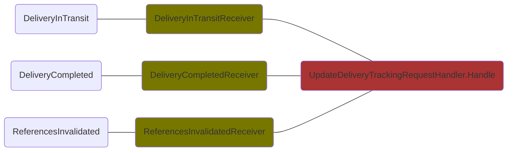
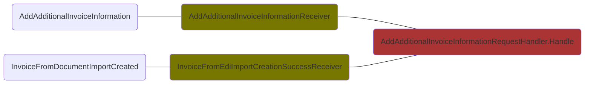
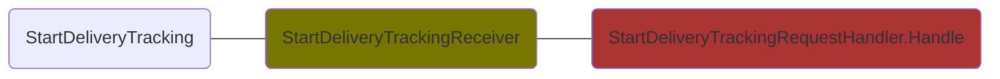

# Provider Order Module Commands
## ProviderDelivery.DeliveryTrackingFeature.UpdateDeliveryTrackingRequestHandler

## ProviderInvoice.AdditionalInvoiceInformationFeature.AddAdditionalInvoiceInformationRequestHandler

## Cancellation.CleanupItemFeature.CleanupItemRequestHandler

```mermaid
flowchart LR
        Dg.ProviderOrder.MessageContracts.Cancellation.V2.CleanupInvoicedButNotDelivered.InvoicedButNotDeliveredItemUpdated(InvoicedButNotDeliveredItemUpdated):::primaryadapterpayload --- Dg.ProviderOrder.Infrastructure.Commands.Cancellation.CleanupItemFeature.InvoicedButNotDeliveredItemUpdatedReceiver(InvoicedButNotDeliveredItemUpdatedReceiver):::primaryadapter --- Dg.ProviderOrder.Application.Commands.Cancellation.CleanupItemFeature.CleanupItemRequestHandler(CleanupItemRequestHandler.Handle):::primaryport
    classDef primaryport fill:#AA3333
    classDef primaryadapter fill:#777700
    classDef nservicebuspayload fill:#AAAA33
```

## Cancellation.ProviderRuling.RateCalculation.UpdateProviderRulingCancellationRateConfigurationHandler

## ProviderDelivery.DeliveryTrackingFeature.StartPlanzerDeliveryTrackingRequestHandler

```mermaid
flowchart LR
        Dg.ProviderOrder.MessageContracts.DeliveryTracking.V1.StartPlanzerDeliveryTracking(StartPlanzerDeliveryTracking):::primaryadapterpayload --- Dg.ProviderOrder.Infrastructure.Commands.ProviderDelivery.DeliveryTrackingFeature.Messaging.StartPlanzerDeliveryTrackingReceiver(StartPlanzerDeliveryTrackingReceiver):::primaryadapter --- Dg.ProviderOrder.Application.Commands.ProviderDelivery.DeliveryTrackingFeature.StartPlanzerDeliveryTrackingRequestHandler(StartPlanzerDeliveryTrackingRequestHandler.Handle):::primaryport
    classDef primaryport fill:#AA3333
    classDef primaryadapter fill:#777700
    classDef nservicebuspayload fill:#AAAA33
```

## ProviderInvoice.ImportedInvoiceFeature.ImportedInvoiceConfigurationUpdateRequestHandler

## ProviderResponse.ExpectedDeliveryDateFeature.ValidDeliveryDateConfigurationUpdateRequestHandler

## Cancellation.CancelRequestFollowupCheckFeature.CancelRequestFollowupCheckConfigurationUpdateRequestHandler

## ProviderInvoice.InvoicePriceDifferenceThreshold.InvoicePriceDifferenceThresholdConfigurationUpdateRequestHandler

## Cancellation.ProviderRuling.RateCalculation.CalculateProviderCancellationRatesRequestHandler

```mermaid
flowchart LR
        Dg.ProviderOrder.MessageContracts.Cancellation.V1.CalculateProviderCancellationRates(CalculateProviderCancellationRates):::primaryadapterpayload --- Dg.ProviderOrder.Infrastructure.Commands.Cancellation.ProviderRuling.RateCalculation.CalculateProviderCancellationRatesCommandReceiver(CalculateProviderCancellationRatesCommandReceiver):::primaryadapter --- Dg.ProviderOrder.Application.Commands.Cancellation.ProviderRuling.RateCalculation.CalculateProviderCancellationRatesRequestHandler(CalculateProviderCancellationRatesRequestHandler.Handle):::primaryport
    classDef primaryport fill:#AA3333
    classDef primaryadapter fill:#777700
    classDef nservicebuspayload fill:#AAAA33
```

## ProviderDelivery.DeliveryTrackingFeature.StartDeliveryTrackingRequestHandler

## Cancellation.ProviderRuling.RespondToImprovementPlan.RespondToImprovementPlanRequestHandler

## ProviderResponse.DelayedEscalationLevel.DelayedEscalationLevelConfigurationUpdateRequestHandler

## ProviderBacklog.UpdateInvoicedButNotDeliveredItemCleanupConfigurationRequestHandler

## Cancellation.ProviderRuling.RateCalculation.InitiateCancellationRatesCalculationHandler

## ProviderDelivery.DeliveryTrackingFeature.UpdateDeliveryTrackingConfigurationRequestHandler

## Cancellation.CleanupItemFeature.CleanupInvoicedButNotDeliveredItemRequestHandler

```mermaid
flowchart LR
        Dg.ProviderOrder.MessageContracts.Cancellation.V2.CleanupInvoicedButNotDelivered.CleanupInvoicedButNotDeliveredItem(CleanupInvoicedButNotDeliveredItem):::primaryadapterpayload --- Dg.ProviderOrder.Infrastructure.Commands.Cancellation.CleanupInvoicedButNotDeliveredFeature.CleanupInvoicedButNotDeliveredItemCommandReceiver(CleanupInvoicedButNotDeliveredItemCommandReceiver):::primaryadapter --- Dg.ProviderOrder.Application.Commands.Cancellation.CleanupItemFeature.CleanupInvoicedButNotDeliveredItemRequestHandler(CleanupInvoicedButNotDeliveredItemRequestHandler.Handle):::primaryport
    classDef primaryport fill:#AA3333
    classDef primaryadapter fill:#777700
    classDef nservicebuspayload fill:#AAAA33
```

## ProviderBacklog.UnattendedAutomaticWarehouseItemDelayConfigurationUpdateRequestHandler

## ProviderResponse.EdiOrderResponseImport.OrderResponseCancellationFeature.OrderResponseCancellationConfigurationUpdateRequestHandler

```mermaid
flowchart LR
    Dg.ProviderOrder.Infrastructure.Commands.ProviderResponse.EdiOrderResponseImport.OrderResponseCancellationFeature.UserInterface.OrderResponseCancellationConfigurationCommandController(OrderResponseCancellationConfigurationCommandController):::primaryadapter --- Dg.ProviderOrder.Application.Commands.ProviderResponse.EdiOrderResponseImport.OrderResponseCancellationFeature.OrderResponseCancellationConfigurationUpdateRequestHandler(OrderResponseCancellationConfigurationUpdateRequestHandler.Handle):::primaryport
    classDef primaryport fill:#AA3333
    classDef primaryadapter fill:#777700
    classDef nservicebuspayload fill:#AAAA33
```

## ProviderDelivery.DispatchNotification.EdiDeliveryNote.ImportDeliveryNoteHandler

## ProviderResponse.EdiOrderResponse.ImportOrderResponseHandler
```mermaid
flowchart LR
    Dg.ProviderOrderInterface.Infrastructure.Commands.Import.ProviderResponse.EdiOrderResponse.KubernetesJobs.OrderResponseImportJob(OrderResponseImportJob):::primaryadapter --- Dg.ProviderOrderInterface.Application.Commands.Import.ProviderResponse.EdiOrderResponse.ImportOrderResponseHandler(ImportOrderResponseHandler.Handle):::primaryport
    classDef primaryport fill:#AA3333
    classDef primaryadapter fill:#777700
    classDef nservicebuspayload fill:#AAAA33
```
## ProviderCancelNotification.ParseProviderCancelNotificationEdiDataHandler
```mermaid
flowchart LR
        Dg.ProviderOrderInterface.MessageContracts.ProviderCancelNotificationImport.V1.ParseProviderCancelNotificationEdiData(ParseProviderCancelNotificationEdiData):::primaryadapterpayload --- Dg.ProviderOrderInterface.Infrastructure.Commands.Import.ProviderCancelNotification.ParseProviderCancelNotificationEdiDataReceiver(ParseProviderCancelNotificationEdiDataReceiver):::primaryadapter --- Dg.ProviderOrderInterface.Application.Commands.Import.ProviderCancelNotification.ParseProviderCancelNotificationEdiDataHandler(ParseProviderCancelNotificationEdiDataHandler.Handle):::primaryport
    classDef primaryport fill:#AA3333
    classDef primaryadapter fill:#777700
    classDef nservicebuspayload fill:#AAAA33
```
## CustomerReturnRegistrationResponse.ImportCustomerReturnRegistrationResponseHandler
```mermaid
flowchart LR
    Dg.ProviderOrderInterface.Infrastructure.Commands.Import.CustomerReturnRegistrationResponse.CustomerReturnRegistrationResponseDownloadJob(CustomerReturnRegistrationResponseDownloadJob):::primaryadapter --- Dg.ProviderOrderInterface.Application.Commands.Import.CustomerReturnRegistrationResponse.ImportCustomerReturnRegistrationResponseHandler(ImportCustomerReturnRegistrationResponseHandler.Handle):::primaryport
    classDef primaryport fill:#AA3333
    classDef primaryadapter fill:#777700
    classDef nservicebuspayload fill:#AAAA33
```
## ProviderInvoice.EdiInvoice.ImportInvoiceHandler
```mermaid
flowchart LR
    Dg.ProviderOrderInterface.Infrastructure.Commands.Import.ProviderInvoice.EdiInvoice.KubernetesJobs.DgOpenTransInvoiceImportJob(DgOpenTransInvoiceImportJob):::primaryadapter --- Dg.ProviderOrderInterface.Application.Commands.Import.ProviderInvoice.EdiInvoice.ImportInvoiceHandler(ImportInvoiceHandler.Handle):::primaryport
    classDef primaryport fill:#AA3333
    classDef primaryadapter fill:#777700
    classDef nservicebuspayload fill:#AAAA33
```
## ProviderInvoice.EdiInvoice.CheckImportedInvoiceReceivedStatusRequestHandler
```mermaid
flowchart LR
        Dg.ProviderOrderInterface.MessageContracts.ProviderInvoice.V1.CheckImportedInvoiceReceivedStatus(CheckImportedInvoiceReceivedStatus):::primaryadapterpayload --- Dg.ProviderOrderInterface.Infrastructure.Commands.Import.ProviderInvoice.EdiInvoice.CheckImportedInvoiceReceivedStatusReceiver(CheckImportedInvoiceReceivedStatusReceiver):::primaryadapter --- Dg.ProviderOrderInterface.Application.Commands.Import.ProviderInvoice.EdiInvoice.CheckImportedInvoiceReceivedStatusRequestHandler(CheckImportedInvoiceReceivedStatusRequestHandler.Handle):::primaryport
    classDef primaryport fill:#AA3333
    classDef primaryadapter fill:#777700
    classDef nservicebuspayload fill:#AAAA33
```
## ProviderInvoice.EdiInvoice.ParseProviderInvoiceRequestHandler
```mermaid
flowchart LR
        Dg.ProviderOrderInterface.MessageContracts.ProviderInvoice.V1.ParseProviderInvoiceEdiData(ParseProviderInvoiceEdiData):::primaryadapterpayload --- Dg.ProviderOrderInterface.Infrastructure.Commands.Import.ProviderInvoice.EdiInvoice.ParseProviderInvoiceReceiver(ParseProviderInvoiceReceiver):::primaryadapter --- Dg.ProviderOrderInterface.Application.Commands.Import.ProviderInvoice.EdiInvoice.ParseProviderInvoiceRequestHandler(ParseProviderInvoiceRequestHandler.Handle):::primaryport
    classDef primaryport fill:#AA3333
    classDef primaryadapter fill:#777700
    classDef nservicebuspayload fill:#AAAA33
```
## ProviderResponse.EdiOrderResponse.ParseOrderResponseEdiDataRequestHandler
```mermaid
flowchart LR
        Dg.ProviderOrderInterface.MessageContracts.OrderResponseImport.V1.ParseOrderResponseEdiData(ParseOrderResponseEdiData):::primaryadapterpayload --- Dg.ProviderOrderInterface.Infrastructure.Commands.Import.ProviderResponse.EdiOrderResponse.Messaging.ParseOrderResponseEdiDataReceiver(ParseOrderResponseEdiDataReceiver):::primaryadapter --- Dg.ProviderOrderInterface.Application.Commands.Import.ProviderResponse.EdiOrderResponse.ParseOrderResponseEdiDataRequestHandler(ParseOrderResponseEdiDataRequestHandler.Handle):::primaryport
    classDef primaryport fill:#AA3333
    classDef primaryadapter fill:#777700
    classDef nservicebuspayload fill:#AAAA33
```
## ProviderInvoice.EdiInvoice.AssignPayablesReferenceToInvoiceEdiDataRequestHandler
```mermaid
flowchart LR
        Dg.ProviderOrderInterface.MessageContracts.ProviderInvoice.V1.AssignPayablesReferenceToInvoiceEdiData(AssignPayablesReferenceToInvoiceEdiData):::primaryadapterpayload --- Dg.ProviderOrderInterface.Infrastructure.Commands.Import.ProviderInvoice.EdiInvoice.AssignPayablesReferenceToInvoiceEdiDataReceiver(AssignPayablesReferenceToInvoiceEdiDataReceiver):::primaryadapter --- Dg.ProviderOrderInterface.Application.Commands.Import.ProviderInvoice.EdiInvoice.AssignPayablesReferenceToInvoiceEdiDataRequestHandler(AssignPayablesReferenceToInvoiceEdiDataRequestHandler.Handle):::primaryport
    classDef primaryport fill:#AA3333
    classDef primaryadapter fill:#777700
    classDef nservicebuspayload fill:#AAAA33
```
## ProviderDelivery.DispatchNotification.EdiDeliveryNote.ParseDeliveryNoteEdiDataRequestHandler
```mermaid
flowchart LR
        Dg.ProviderOrderInterface.MessageContracts.ProviderDelivery.V1.ParseDeliveryNoteEdiData(ParseDeliveryNoteEdiData):::primaryadapterpayload --- Dg.ProviderOrderInterface.Infrastructure.Commands.Import.ProviderDelivery.DispatchNotification.EdiDispatchNotification.ParseDeliveryNoteEdiDataCommandReceiver(ParseDeliveryNoteEdiDataCommandReceiver):::primaryadapter --- Dg.ProviderOrderInterface.Application.Commands.Import.ProviderDelivery.DispatchNotification.EdiDeliveryNote.ParseDeliveryNoteEdiDataRequestHandler(ParseDeliveryNoteEdiDataRequestHandler.Handle):::primaryport
    classDef primaryport fill:#AA3333
    classDef primaryadapter fill:#777700
    classDef nservicebuspayload fill:#AAAA33
```
## ProviderCancelNotification.ImportProviderCancelNotificationHandler
```mermaid
flowchart LR
    Dg.ProviderOrderInterface.Infrastructure.Commands.Import.ProviderCancelNotification.ProviderCancelNotificationDownloadJob(ProviderCancelNotificationDownloadJob):::primaryadapter --- Dg.ProviderOrderInterface.Application.Commands.Import.ProviderCancelNotification.ImportProviderCancelNotificationHandler(ImportProviderCancelNotificationHandler.Handle):::primaryport
    classDef primaryport fill:#AA3333
    classDef primaryadapter fill:#777700
    classDef nservicebuspayload fill:#AAAA33
```
## ProviderInvoice.EdiInvoice.TriggerLegacyInvoiceEdiDataFlowRequestHandler
```mermaid
flowchart LR
        Dg.ProviderOrderInterface.MessageContracts.ProviderInvoice.V1.TriggerLegacyInvoiceEdiDataFlow(TriggerLegacyInvoiceEdiDataFlow):::primaryadapterpayload --- Dg.ProviderOrderInterface.Infrastructure.Commands.Import.ProviderInvoice.EdiInvoice.TriggerLegacyInvoiceEdiDataFlowReceiver(TriggerLegacyInvoiceEdiDataFlowReceiver):::primaryadapter --- Dg.ProviderOrderInterface.Application.Commands.Import.ProviderInvoice.EdiInvoice.TriggerLegacyInvoiceEdiDataFlowRequestHandler(TriggerLegacyInvoiceEdiDataFlowRequestHandler.Handle):::primaryport
    classDef primaryport fill:#AA3333
    classDef primaryadapter fill:#777700
    classDef nservicebuspayload fill:#AAAA33
```
## ProviderInvoice.EdiInvoice.ManualIntervention.DeleteInvoiceParsingRequestHandler
```mermaid
flowchart LR
    Dg.ProviderOrderInterface.Infrastructure.Commands.Import.ProviderInvoice.EdiInvoice.WebApi.DeleteInvoiceParsingController(DeleteInvoiceParsingController):::primaryadapter --- Dg.ProviderOrderInterface.Application.Commands.Import.ProviderInvoice.EdiInvoice.ManualIntervention.DeleteInvoiceParsingRequestHandler(DeleteInvoiceParsingRequestHandler.Handle):::primaryport
    classDef primaryport fill:#AA3333
    classDef primaryadapter fill:#777700
    classDef nservicebuspayload fill:#AAAA33
```
## ProviderInvoice.EdiInvoice.ImportConextradeInvoiceRequestHandler
```mermaid
flowchart LR
        Dg.ProviderOrderInterface.MessageContracts.InvoiceImport.V1.ImportConextradeInvoice(ImportConextradeInvoice):::primaryadapterpayload --- Dg.ProviderOrderInterface.Infrastructure.Commands.Import.ProviderInvoice.EdiInvoice.ImportConextradeInvoiceReceiver(ImportConextradeInvoiceReceiver):::primaryadapter --- Dg.ProviderOrderInterface.Application.Commands.Import.ProviderInvoice.EdiInvoice.ImportConextradeInvoiceRequestHandler(ImportConextradeInvoiceRequestHandler.Handle):::primaryport
    classDef primaryport fill:#AA3333
    classDef primaryadapter fill:#777700
    classDef nservicebuspayload fill:#AAAA33
```
## CustomerReturnRegistrationResponse.ParseCustomerReturnRegistrationResponseHandler
```mermaid
flowchart LR
        Dg.ProviderOrderInterface.MessageContracts.CustomerReturnRegistrationResponseImport.V1.ParseCustomerReturnRegistrationResponseEdiData(ParseCustomerReturnRegistrationResponseEdiData):::primaryadapterpayload --- Dg.ProviderOrderInterface.Infrastructure.Commands.Import.CustomerReturnRegistrationResponse.ParseCustomerReturnRegistrationResponseEdiDataReceiver(ParseCustomerReturnRegistrationResponseEdiDataReceiver):::primaryadapter --- Dg.ProviderOrderInterface.Application.Commands.Import.CustomerReturnRegistrationResponse.ParseCustomerReturnRegistrationResponseHandler(ParseCustomerReturnRegistrationResponseHandler.Handle):::primaryport
    classDef primaryport fill:#AA3333
    classDef primaryadapter fill:#777700
    classDef nservicebuspayload fill:#AAAA33
```
## ProviderEdiDataDownloadFeature.DownloadProviderEdiDataHandler
```mermaid
flowchart LR
    Dg.ProviderOrderInterface.Infrastructure.ProviderEdiDataDownloadFeature.KubernetesJobs.SupplierReturnNotificationDownloadJob(SupplierReturnNotificationDownloadJob):::primaryadapter --- Dg.ProviderOrderInterface.Application.Commands.ProviderEdiDataDownloadFeature.DownloadProviderEdiDataHandler(DownloadProviderEdiDataHandler.Handle):::primaryport
    Dg.ProviderOrderInterface.Infrastructure.ProviderEdiDataDownloadFeature.KubernetesJobs.CancelRequestResponseDownloadJob(CancelRequestResponseDownloadJob):::primaryadapter --- Dg.ProviderOrderInterface.Application.Commands.ProviderEdiDataDownloadFeature.DownloadProviderEdiDataHandler(DownloadProviderEdiDataHandler.Handle):::primaryport
    classDef primaryport fill:#AA3333
    classDef primaryadapter fill:#777700
    classDef nservicebuspayload fill:#AAAA33
```
## OrderExportFeature.EmailOrder.StoreManualEmailOrderExportRequestHandler
```mermaid
flowchart LR
        Dg.ProviderOrderInterface.MessageContracts.OrderExport.V1.StoreManualEmailOrderExport(StoreManualEmailOrderExport):::primaryadapterpayload --- Dg.ProviderOrderInterface.Infrastructure.Commands.Export.OrderExportFeature.EmailOrder.Messaging.StoreManualEmailOrderExportReceiver(StoreManualEmailOrderExportReceiver):::primaryadapter --- Dg.ProviderOrderInterface.Application.Commands.Export.OrderExportFeature.EmailOrder.StoreManualEmailOrderExportRequestHandler(StoreManualEmailOrderExportRequestHandler.Handle):::primaryport
    classDef primaryport fill:#AA3333
    classDef primaryadapter fill:#777700
    classDef nservicebuspayload fill:#AAAA33
```
## OrderExportFeature.EdiOrder.AllowNewOrderExportRequestHandler
```mermaid
flowchart LR
        Dg.ProviderOrderInterface.MessageContracts.OrderExport.V1.AllowNewOrderExport(AllowNewOrderExport):::primaryadapterpayload --- Dg.ProviderOrderInterface.Infrastructure.Commands.Export.OrderExportFeature.Messaging.AllowNewOrderExportReceiver(AllowNewOrderExportReceiver):::primaryadapter --- Dg.ProviderOrderInterface.Application.Commands.Export.OrderExportFeature.EdiOrder.AllowNewOrderExportRequestHandler(AllowNewOrderExportRequestHandler.Handle):::primaryport
    classDef primaryport fill:#AA3333
    classDef primaryadapter fill:#777700
    classDef nservicebuspayload fill:#AAAA33
```
## Cancellation.ProviderRuling.UpdateImprovementPlan.UpdateImprovementPlanHandler
```mermaid
flowchart LR
    Dg.ProviderOrder.Infrastructure.Commands.Cancellation.ProviderRuling.ImprovementPlan.ImprovementPlanUpdate.UserInterface.UpdateImprovementPlanController(UpdateImprovementPlanController):::primaryadapter --- Dg.ProviderOrder.Application.Commands.Cancellation.ProviderRuling.UpdateImprovementPlan.UpdateImprovementPlanHandler(UpdateImprovementPlanHandler.Handle):::primaryport
    classDef primaryport fill:#AA3333
    classDef primaryadapter fill:#777700
    classDef nservicebuspayload fill:#AAAA33
```
## Cancellation.ProviderRuling.CreateImprovementPlan.CreateImprovementPlanHandler
```mermaid
flowchart LR
    Dg.ProviderOrder.Infrastructure.Commands.Cancellation.ProviderRuling.ImprovementPlan.ImprovementPlanCreation.UserInterface.CreateImprovementPlanController(CreateImprovementPlanController):::primaryadapter --- Dg.ProviderOrder.Application.Commands.Cancellation.ProviderRuling.CreateImprovementPlan.CreateImprovementPlanHandler(CreateImprovementPlanHandler.Handle):::primaryport
    classDef primaryport fill:#AA3333
    classDef primaryadapter fill:#777700
    classDef nservicebuspayload fill:#AAAA33
```
## OrderExportFeature.ExportOrderRequestHandler
```mermaid
flowchart LR
        Dg.ProviderOrderInterface.MessageContracts.OrderExport.V1.ExportOrder(ExportOrder):::primaryadapterpayload --- Dg.ProviderOrderInterface.Infrastructure.Commands.Export.OrderExportFeature.Messaging.ExportOrderReceiver(ExportOrderReceiver):::primaryadapter --- Dg.ProviderOrderInterface.Application.Commands.Export.OrderExportFeature.ExportOrderRequestHandler(ExportOrderRequestHandler.Handle):::primaryport
    classDef primaryport fill:#AA3333
    classDef primaryadapter fill:#777700
    classDef nservicebuspayload fill:#AAAA33
```
## ProviderInvoice.EdiInvoice.ManualIntervention.UpdateInvoiceParsedLineRequestHandler
```mermaid
flowchart LR
    Dg.ProviderOrderInterface.Infrastructure.Commands.Import.ProviderInvoice.EdiInvoice.WebApi.UpdateImportedInvoiceProductLinesPriceController(UpdateImportedInvoiceProductLinesPriceController):::primaryadapter --- Dg.ProviderOrderInterface.Application.Commands.Import.ProviderInvoice.EdiInvoice.ManualIntervention.UpdateInvoiceParsedLineRequestHandler(UpdateInvoiceParsedLineRequestHandler.Handle):::primaryport
    classDef primaryport fill:#AA3333
    classDef primaryadapter fill:#777700
    classDef nservicebuspayload fill:#AAAA33
```
## BlobStorageDistribution.DistributeBlobRequestHandler
```mermaid
flowchart LR
    Dg.ProviderOrderInterface.Infrastructure.Commands.BlobStorageDistribution.WebApi.BlobStorageDistributionController(BlobStorageDistributionController):::primaryadapter --- Dg.ProviderOrderInterface.Application.Commands.BlobStorageDistribution.DistributeBlobRequestHandler(DistributeBlobRequestHandler.Handle):::primaryport
    classDef primaryport fill:#AA3333
    classDef primaryadapter fill:#777700
    classDef nservicebuspayload fill:#AAAA33
```
## CustomerReturnRegistrationExportFeature.ExportCustomerReturnRegistrationHandler
```mermaid
flowchart LR
        Dg.ProviderOrderInterface.MessageContracts.CustomerReturnRegistrationExport.V1.ExportCustomerReturnRegistration(ExportCustomerReturnRegistration):::primaryadapterpayload --- Dg.ProviderOrderInterface.Infrastructure.Commands.Export.CustomerReturnRegistrationExportFeature.Messaging.ExportCustomerReturnRegistrationReceiver(ExportCustomerReturnRegistrationReceiver):::primaryadapter --- Dg.ProviderOrderInterface.Application.Commands.Export.CustomerReturnRegistrationExportFeature.ExportCustomerReturnRegistrationHandler(ExportCustomerReturnRegistrationHandler.Handle):::primaryport
    classDef primaryport fill:#AA3333
    classDef primaryadapter fill:#777700
    classDef nservicebuspayload fill:#AAAA33
```
## ProviderResponse.EdiOrderResponse.StoreOrderResponseEdiDataForEdiTestingHandler
```mermaid
flowchart LR
    Dg.ProviderOrderInterface.Infrastructure.Commands.Import.ProviderResponse.EdiOrderResponse.WebApi.OrderResponseController(OrderResponseController):::primaryadapter --- Dg.ProviderOrderInterface.Application.Commands.Import.ProviderResponse.EdiOrderResponse.StoreOrderResponseEdiDataForEdiTestingHandler(StoreOrderResponseEdiDataForEdiTestingHandler.Handle):::primaryport
    classDef primaryport fill:#AA3333
    classDef primaryadapter fill:#777700
    classDef nservicebuspayload fill:#AAAA33
```
## ProviderInvoice.EdiInvoice.ManualIntervention.StoreInvoiceEdiDataForEdiTestingRequestHandler
```mermaid
flowchart LR
    Dg.ProviderOrderInterface.Infrastructure.Commands.Import.ProviderInvoice.EdiInvoice.WebApi.EdiInvoiceTestingController(EdiInvoiceTestingController):::primaryadapter --- Dg.ProviderOrderInterface.Application.Commands.Import.ProviderInvoice.EdiInvoice.ManualIntervention.StoreInvoiceEdiDataForEdiTestingRequestHandler(StoreInvoiceEdiDataForEdiTestingRequestHandler.Handle):::primaryport
    classDef primaryport fill:#AA3333
    classDef primaryadapter fill:#777700
    classDef nservicebuspayload fill:#AAAA33
```
## ProviderResponse.EdiOrderResponse.EditEdiContent.EditOrderResponseEdiContentHandler
```mermaid
flowchart LR
    Dg.ProviderOrderInterface.Infrastructure.Commands.Import.ProviderResponse.EdiOrderResponse.EditEdiContent.OrderResponseEdiContentEditController(OrderResponseEdiContentEditController):::primaryadapter --- Dg.ProviderOrderInterface.Application.Commands.Import.ProviderResponse.EdiOrderResponse.EditEdiContent.EditOrderResponseEdiContentHandler(EditOrderResponseEdiContentHandler.Handle):::primaryport
    classDef primaryport fill:#AA3333
    classDef primaryadapter fill:#777700
    classDef nservicebuspayload fill:#AAAA33
```
## ProviderInvoice.EdiInvoice.ManualIntervention.ReimportInvoiceHandler
```mermaid
flowchart LR
    Dg.ProviderOrderInterface.Infrastructure.Commands.Import.ProviderInvoice.EdiInvoice.WebApi.ReimportInvoiceController(ReimportInvoiceController):::primaryadapter --- Dg.ProviderOrderInterface.Application.Commands.Import.ProviderInvoice.EdiInvoice.ManualIntervention.ReimportInvoiceHandler(ReimportInvoiceHandler.Handle):::primaryport
    classDef primaryport fill:#AA3333
    classDef primaryadapter fill:#777700
    classDef nservicebuspayload fill:#AAAA33
```
## CancelRequestExportFeature.ExportCancelRequestHandler
```mermaid
flowchart LR
        Dg.ProviderOrderInterface.MessageContracts.CancelRequestExport.V1.ExportCancelRequest(ExportCancelRequest):::primaryadapterpayload --- Dg.ProviderOrderInterface.Infrastructure.Commands.Export.CancelRequestExportFeature.Messaging.ExportCancelRequestReceiver(ExportCancelRequestReceiver):::primaryadapter --- Dg.ProviderOrderInterface.Application.Commands.Export.CancelRequestExportFeature.ExportCancelRequestHandler(ExportCancelRequestHandler.Handle):::primaryport
    classDef primaryport fill:#AA3333
    classDef primaryadapter fill:#777700
    classDef nservicebuspayload fill:#AAAA33
```
## ProviderDelivery.DispatchNotification.EdiDeliveryNote.StoreDeliveryNoteEdiDataForEdiTestingRequestHandler
```mermaid
flowchart LR
    Dg.ProviderOrderInterface.Infrastructure.Commands.Import.ProviderDelivery.DispatchNotification.EdiDispatchNotification.WebApi.EdiDeliveryNoteController(EdiDeliveryNoteController):::primaryadapter --- Dg.ProviderOrderInterface.Application.Commands.Import.ProviderDelivery.DispatchNotification.EdiDeliveryNote.StoreDeliveryNoteEdiDataForEdiTestingRequestHandler(StoreDeliveryNoteEdiDataForEdiTestingRequestHandler.Handle):::primaryport
    classDef primaryport fill:#AA3333
    classDef primaryadapter fill:#777700
    classDef nservicebuspayload fill:#AAAA33
```
