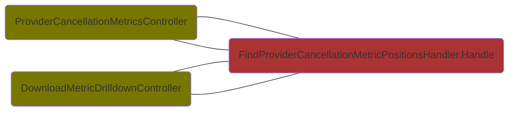

# Provider Order Module Queries
## ProviderDelivery.WarehouseDeliveryNotePdf.GenerateWarehouseDeliveryNotePdfHandler

## ProviderProductIdentityFeature.GetProviderProductKeySamplesHandler

## ProviderDelivery.DeliveryTrackingFeature.GetDeliveryTrackingInformationFromDeliveryIdHandler

## ProviderProductIdentityFeature.GetProviderProductKeySampleHotAnd30DaysHandler

## Cancellation.ProviderRuling.CancellationMetrics.FindProviderCancellationMetricPositionsHandler

## ProviderProductIdentityFeature.FindProductIdsHandler

## ProviderOrderConfirmationFeature.GetProviderOrderConfirmationsHandler

## ProviderOrderItemProductInformationFeature.FindProviderOrderItemProductInformationFromIdRequestHandler

## ProviderOrderItemProductFeature.GetProviderOrderItemProductOverviewsHandler

## ProviderOrderItemProductInformationFeature.FindProviderOrderItemProductInformationFromReferenceRequestHandler

## ProviderOrderItemProductFeature.GetProviderOrderItemProductDetailHandler

## ProviderProductIdentityFeature.FindProviderProductIdentityHandler

## ProviderBacklog.WarehouseDelivery.HasOpenBacklogHandler

## PurchasePriceForCustomerItemFeature.GetProviderOrderConfirmationsHandler

## ProviderOrderItemProductForDirectDeliveryCustomerItemFeature.GetProviderOrderConfirmationsHandler

## PurchaseDateForCustomerItemFeature.GetPurchaseDatesForCustomerItemsHandler

## ProviderDelivery.DeliveryTrackingFeature.GetDeliveryTrackingInformationFromProviderOrderItemProductIdHandler

## Cancellation.ProviderRuling.ImprovementPlan.CreateAndUpdateImprovementPlan.GetCreateImprovementPlanViewDataHandler

## Cancellation.ProviderRuling.ImprovementPlan.RespondToImprovementPlan.GetRecentImprovementPlansWithPhasesHandler

## ConextradeInvoiceFeature.HasConextradeInvoiceHandler

## ProviderDelivery.DispatchNotification.EdiDeliveryNote.GetImportedDeliveryNoteFromDeliveryNoteEdiDataIdHandler
```mermaid
flowchart LR
    Dg.ProviderOrderInterface.Infrastructure.Queries.Import.ProviderDelivery.EdiDeliveryNote.WebApi.ImportedDeliveryNoteController(ImportedDeliveryNoteController):::primaryadapter --- Dg.ProviderOrderInterface.Application.Queries.Import.ProviderDelivery.DispatchNotification.EdiDeliveryNote.GetImportedDeliveryNoteFromDeliveryNoteEdiDataIdHandler(GetImportedDeliveryNoteFromDeliveryNoteEdiDataIdHandler.Handle):::primaryport
    classDef primaryport fill:#AA3333
    classDef primaryadapter fill:#777700
    classDef nservicebuspayload fill:#AAAA33
```
## OrderExportResultFeature.FindOrderExportResultByIdHandler
```mermaid
flowchart LR
    Dg.ProviderOrderInterface.Infrastructure.Queries.Export.OrderExportFeature.UserInterface.OrderExportResultController(OrderExportResultController):::primaryadapter --- Dg.ProviderOrderInterface.Application.Queries.Export.OrderExportResultFeature.FindOrderExportResultByIdHandler(FindOrderExportResultByIdHandler.Handle):::primaryport
    classDef primaryport fill:#AA3333
    classDef primaryadapter fill:#777700
    classDef nservicebuspayload fill:#AAAA33
```
## ProviderResponse.EdiOrderResponse.FindOrderResponseEdiContentHandler
```mermaid
flowchart LR
    Dg.ProviderOrderInterface.Infrastructure.Queries.Import.ProviderResponse.EdiOrderResponse.UserInterface.OrderResponseEdiContentController(OrderResponseEdiContentController):::primaryadapter --- Dg.ProviderOrderInterface.Application.Queries.Import.ProviderResponse.EdiOrderResponse.FindOrderResponseEdiContentHandler(FindOrderResponseEdiContentHandler.Handle):::primaryport
    Dg.ProviderOrderInterface.Infrastructure.Queries.Import.ProviderResponse.EdiOrderResponse.UserInterface.OrderResponseEdiContentController(OrderResponseEdiContentController):::primaryadapter --- Dg.ProviderOrderInterface.Application.Queries.Import.ProviderResponse.EdiOrderResponse.FindOrderResponseEdiContentHandler(FindOrderResponseEdiContentHandler.Handle):::primaryport
    classDef primaryport fill:#AA3333
    classDef primaryadapter fill:#777700
    classDef nservicebuspayload fill:#AAAA33
```
## CustomerReturnRegistrationExportResultFeature.FindCustomerReturnRegistrationExportResultPreviewsByOrderIdHandler
```mermaid
flowchart LR
    Dg.ProviderOrderInterface.Infrastructure.Queries.Export.CustomerReturnRegistrationExportFeature.WebApi.CustomerReturnRegistrationExportResultController(CustomerReturnRegistrationExportResultController):::primaryadapter --- Dg.ProviderOrderInterface.Application.Queries.Export.CustomerReturnRegistrationExportResultFeature.FindCustomerReturnRegistrationExportResultPreviewsByOrderIdHandler(FindCustomerReturnRegistrationExportResultPreviewsByOrderIdHandler.Handle):::primaryport
    classDef primaryport fill:#AA3333
    classDef primaryadapter fill:#777700
    classDef nservicebuspayload fill:#AAAA33
```
## OrderExportFeature.EmailOrder.GetMailtoUriRequestHandler
```mermaid
flowchart LR
    Dg.ProviderOrderInterface.Infrastructure.Queries.Export.OrderExportFeature.EmailOrder.ManualEmailOrderExportController(ManualEmailOrderExportController):::primaryadapter --- Dg.ProviderOrderInterface.Application.Queries.Export.OrderExportFeature.EmailOrder.GetMailtoUriRequestHandler(GetMailtoUriRequestHandler.Handle):::primaryport
    classDef primaryport fill:#AA3333
    classDef primaryadapter fill:#777700
    classDef nservicebuspayload fill:#AAAA33
```
## ProviderInvoice.EdiInvoice.GetConextradeAttachmentRequestHandler
```mermaid
flowchart LR
    Dg.ProviderOrderInterface.Infrastructure.Queries.Import.ProviderInvoice.EdiInvoice.WebApi.ConextradeAttachmentController(ConextradeAttachmentController):::primaryadapter --- Dg.ProviderOrderInterface.Application.Queries.Import.ProviderInvoice.EdiInvoice.GetConextradeAttachmentRequestHandler(GetConextradeAttachmentRequestHandler.Handle):::primaryport
    classDef primaryport fill:#AA3333
    classDef primaryadapter fill:#777700
    classDef nservicebuspayload fill:#AAAA33
```
## CancelRequestExportResultFeature.FindCancelRequestExportResultPreviewsByOrderIdHandler
```mermaid
flowchart LR
    Dg.ProviderOrderInterface.Infrastructure.Queries.Export.CancelRequestExportFeature.WebApi.CancelRequestExportResultController(CancelRequestExportResultController):::primaryadapter --- Dg.ProviderOrderInterface.Application.Queries.Export.CancelRequestExportResultFeature.FindCancelRequestExportResultPreviewsByOrderIdHandler(FindCancelRequestExportResultPreviewsByOrderIdHandler.Handle):::primaryport
    classDef primaryport fill:#AA3333
    classDef primaryadapter fill:#777700
    classDef nservicebuspayload fill:#AAAA33
```
## OrderExportFeature.FindOrderExportEdiDataContentByIdHandler
```mermaid
flowchart LR
    Dg.ProviderOrderInterface.Infrastructure.Queries.Export.OrderExportFeature.WebApi.OrderExportEdiDataContentController(OrderExportEdiDataContentController):::primaryadapter --- Dg.ProviderOrderInterface.Application.Queries.Export.OrderExportFeature.FindOrderExportEdiDataContentByIdHandler(FindOrderExportEdiDataContentByIdHandler.Handle):::primaryport
    classDef primaryport fill:#AA3333
    classDef primaryadapter fill:#777700
    classDef nservicebuspayload fill:#AAAA33
```
## OrderExportResultFeature.CountOrderExportsByOrderIdHandler
```mermaid
flowchart LR
    Dg.ProviderOrderInterface.Infrastructure.Queries.Export.OrderExportFeature.WebApi.OrderExportCountController(OrderExportCountController):::primaryadapter --- Dg.ProviderOrderInterface.Application.Queries.Export.OrderExportResultFeature.CountOrderExportsByOrderIdHandler(CountOrderExportsByOrderIdHandler.Handle):::primaryport
    classDef primaryport fill:#AA3333
    classDef primaryadapter fill:#777700
    classDef nservicebuspayload fill:#AAAA33
```
## CancelRequestExportFeature.FindCancelRequestExportEdiDataContentByIdHandler
```mermaid
flowchart LR
    Dg.ProviderOrderInterface.Infrastructure.Queries.Export.CancelRequestExportFeature.WebApi.CancelRequestExportEdiDataContentController(CancelRequestExportEdiDataContentController):::primaryadapter --- Dg.ProviderOrderInterface.Application.Queries.Export.CancelRequestExportFeature.FindCancelRequestExportEdiDataContentByIdHandler(FindCancelRequestExportEdiDataContentByIdHandler.Handle):::primaryport
    classDef primaryport fill:#AA3333
    classDef primaryadapter fill:#777700
    classDef nservicebuspayload fill:#AAAA33
```
## ProviderResponse.EdiOrderResponse.GetDownloadedOrderResponseEdiDataHandler
```mermaid
flowchart LR
    Dg.ProviderOrderInterface.Infrastructure.Queries.Import.ProviderResponse.EdiOrderResponse.WebApi.OrderResponseEdiDataController(OrderResponseEdiDataController):::primaryadapter --- Dg.ProviderOrderInterface.Application.Queries.Import.ProviderResponse.EdiOrderResponse.GetDownloadedOrderResponseEdiDataHandler(GetDownloadedOrderResponseEdiDataHandler.Handle):::primaryport
    classDef primaryport fill:#AA3333
    classDef primaryadapter fill:#777700
    classDef nservicebuspayload fill:#AAAA33
```
## CustomerReturnRegistrationExportResultFeature.FindCustomerReturnRegistrationExportResultByIdHandler
```mermaid
flowchart LR
    Dg.ProviderOrderInterface.Infrastructure.Queries.Export.CustomerReturnRegistrationExportFeature.UserInterface.CustomerReturnRegistrationExportResultController(CustomerReturnRegistrationExportResultController):::primaryadapter --- Dg.ProviderOrderInterface.Application.Queries.Export.CustomerReturnRegistrationExportResultFeature.FindCustomerReturnRegistrationExportResultByIdHandler(FindCustomerReturnRegistrationExportResultByIdHandler.Handle):::primaryport
    classDef primaryport fill:#AA3333
    classDef primaryadapter fill:#777700
    classDef nservicebuspayload fill:#AAAA33
```
## GetEdiInterfaceProvidersFeature.GetEdiInterfaceProvidersHandler
```mermaid
flowchart LR
    Dg.ProviderOrderInterface.Infrastructure.Queries.GetEdiInterfaceProvidersFeature.WebApi.EdiInterfaceProvidersController(EdiInterfaceProvidersController):::primaryadapter --- Dg.ProviderOrderInterface.Application.Queries.GetEdiInterfaceProvidersFeature.GetEdiInterfaceProvidersHandler(GetEdiInterfaceProvidersHandler.Handle):::primaryport
    classDef primaryport fill:#AA3333
    classDef primaryadapter fill:#777700
    classDef nservicebuspayload fill:#AAAA33
```
## ProviderResponse.EdiOrderResponse.GetImportedOrderResponseHandler
```mermaid
flowchart LR
    Dg.ProviderOrderInterface.Infrastructure.Queries.Import.ProviderResponse.EdiOrderResponse.WebApi.ImportedOrderResponseController(ImportedOrderResponseController):::primaryadapter --- Dg.ProviderOrderInterface.Application.Queries.Import.ProviderResponse.EdiOrderResponse.GetImportedOrderResponseHandler(GetImportedOrderResponseHandler.Handle):::primaryport
    classDef primaryport fill:#AA3333
    classDef primaryadapter fill:#777700
    classDef nservicebuspayload fill:#AAAA33
```
## CancelRequestExportResultFeature.FindCancelRequestExportResultByIdHandler
```mermaid
flowchart LR
    Dg.ProviderOrderInterface.Infrastructure.Queries.Export.CancelRequestExportFeature.UserInterface.CancelRequestExportResultController(CancelRequestExportResultController):::primaryadapter --- Dg.ProviderOrderInterface.Application.Queries.Export.CancelRequestExportResultFeature.FindCancelRequestExportResultByIdHandler(FindCancelRequestExportResultByIdHandler.Handle):::primaryport
    classDef primaryport fill:#AA3333
    classDef primaryadapter fill:#777700
    classDef nservicebuspayload fill:#AAAA33
```
## OrderExportResultFeature.FindOrderExportResultPreviewsByOrderIdHandler
```mermaid
flowchart LR
    Dg.ProviderOrderInterface.Infrastructure.Queries.Export.OrderExportFeature.WebApi.OrderExportResultController(OrderExportResultController):::primaryadapter --- Dg.ProviderOrderInterface.Application.Queries.Export.OrderExportResultFeature.FindOrderExportResultPreviewsByOrderIdHandler(FindOrderExportResultPreviewsByOrderIdHandler.Handle):::primaryport
    classDef primaryport fill:#AA3333
    classDef primaryadapter fill:#777700
    classDef nservicebuspayload fill:#AAAA33
```
## ProviderInvoice.EdiInvoice.EdiInvoiceAdditionalInformationRequestHandler
```mermaid
flowchart LR
    Dg.ProviderOrderInterface.Infrastructure.Queries.Import.ProviderInvoice.EdiInvoice.WebApi.EdiInvoiceAdditionalInformationController(EdiInvoiceAdditionalInformationController):::primaryadapter --- Dg.ProviderOrderInterface.Application.Queries.Import.ProviderInvoice.EdiInvoice.EdiInvoiceAdditionalInformationRequestHandler(EdiInvoiceAdditionalInformationRequestHandler.Handle):::primaryport
    classDef primaryport fill:#AA3333
    classDef primaryadapter fill:#777700
    classDef nservicebuspayload fill:#AAAA33
```
## CustomerReturnRegistrationExportFeature.FindCustomerReturnRegistrationExportEdiDataContentByIdHandler
```mermaid
flowchart LR
    Dg.ProviderOrderInterface.Infrastructure.Queries.Export.CustomerReturnRegistrationExportFeature.WebApi.CustomerReturnRegistrationExportEdiDataContentController(CustomerReturnRegistrationExportEdiDataContentController):::primaryadapter --- Dg.ProviderOrderInterface.Application.Queries.Export.CustomerReturnRegistrationExportFeature.FindCustomerReturnRegistrationExportEdiDataContentByIdHandler(FindCustomerReturnRegistrationExportEdiDataContentByIdHandler.Handle):::primaryport
    classDef primaryport fill:#AA3333
    classDef primaryadapter fill:#777700
    classDef nservicebuspayload fill:#AAAA33
```
## GetDgOpenTransConfigurationsFeature.GetProviderOrderConfirmationsHandler
```mermaid
flowchart LR
    Dg.ProviderOrderInterface.Infrastructure.Queries.GetDgOpenTransConfigurationsFeature.WebApi.DgOpenTransConfigurationController(DgOpenTransConfigurationController):::primaryadapter --- Dg.ProviderOrderInterface.Application.Queries.GetDgOpenTransConfigurationsFeature.GetProviderOrderConfirmationsHandler(GetProviderOrderConfirmationsHandler.Handle):::primaryport
    classDef primaryport fill:#AA3333
    classDef primaryadapter fill:#777700
    classDef nservicebuspayload fill:#AAAA33
```
