# Provider Order Component Commands
## ProviderDelivery.DispatchNotificationFeature.EdiDispatchNotification.DeliveryNoteProcessingService
```mermaid
flowchart LR
    Dg.ProviderOrder.Infrastructure.Commands.ProviderDelivery.DispatchNotificationFeature.EdiDispatchNotification.ManualIntervention.Reprocess.EdiDeliveryNoteReprocessController(EdiDeliveryNoteReprocessController):::primaryadapter --- Dg.ProviderOrder.Application.Commands.ProviderDelivery.DispatchNotificationFeature.EdiDispatchNotification.DeliveryNoteProcessingService(DeliveryNoteProcessingService.ParseAndProcessDeliveryNoteAsync):::primaryport
    Dg.ProviderOrder.Application.Commands.ProviderDelivery.DispatchNotificationFeature.EdiDispatchNotification.DeliveryNoteProcessingService(DeliveryNoteProcessingService.ParseAndProcessDeliveryNoteAsync):::primaryport --- Dg.ProviderOrder.Domain.ProviderDelivery.DispatchNotificationFeature.EdiDispatchNotification.DigitalArticleToPublish_Outbox(DigitalArticleToPublish):::outboxpayload
    Dg.ProviderOrder.Domain.ProviderDelivery.DispatchNotificationFeature.EdiDispatchNotification.DigitalArticleToPublish_Outbox(DigitalArticleToPublish):::outboxpayload --- NServiceBus.ICommand_NServiceBus(ICommand):::nservicebuspayload
    Dg.ProviderOrder.Application.Commands.ProviderDelivery.DispatchNotificationFeature.EdiDispatchNotification.DeliveryNoteProcessingService(DeliveryNoteProcessingService.ParseAndProcessDeliveryNoteAsync):::primaryport --- Dg.ProviderOrder.MessageContracts.ProviderOrderItemsDispatched.WarehouseDelivery.V1.WarehouseDeliveryProviderOrderItemsDispatched_Outbox(WarehouseDeliveryProviderOrderItemsDispatched):::outboxpayload
    Dg.ProviderOrder.MessageContracts.ProviderOrderItemsDispatched.WarehouseDelivery.V1.WarehouseDeliveryProviderOrderItemsDispatched_Outbox(WarehouseDeliveryProviderOrderItemsDispatched):::outboxpayload --- WarehouseDeliveryProviderOrderItemsDispatched_NServiceBus(WarehouseDeliveryProviderOrderItemsDispatched):::nservicebuspayload
    Dg.ProviderOrder.Application.Commands.ProviderDelivery.DispatchNotificationFeature.EdiDispatchNotification.DeliveryNoteProcessingService(DeliveryNoteProcessingService.ParseAndProcessDeliveryNoteAsync):::primaryport --- Dg.ProviderOrder.MessageContracts.ProviderOrderItemsDispatched.DirectDelivery.V1.DirectDeliveryProviderOrderItemsDispatched_Outbox(DirectDeliveryProviderOrderItemsDispatched):::outboxpayload
    Dg.ProviderOrder.MessageContracts.ProviderOrderItemsDispatched.DirectDelivery.V1.DirectDeliveryProviderOrderItemsDispatched_Outbox(DirectDeliveryProviderOrderItemsDispatched):::outboxpayload --- DirectDeliveryProviderOrderItemsDispatched_NServiceBus(DirectDeliveryProviderOrderItemsDispatched):::nservicebuspayload
    Dg.ProviderOrder.Application.Commands.ProviderDelivery.DispatchNotificationFeature.EdiDispatchNotification.DeliveryNoteProcessingService(DeliveryNoteProcessingService.ParseAndProcessDeliveryNoteAsync):::primaryport --- Dg.ProviderOrder.MessageContracts.DeliveryTracking.V1.StartDeliveryTracking_Outbox(StartDeliveryTracking):::outboxpayload
    Dg.ProviderOrder.MessageContracts.DeliveryTracking.V1.StartDeliveryTracking_Outbox(StartDeliveryTracking):::outboxpayload --- StartDeliveryTracking_NServiceBus(StartDeliveryTracking):::nservicebuspayload
    Dg.ProviderOrder.Application.Commands.ProviderDelivery.DispatchNotificationFeature.EdiDispatchNotification.DeliveryNoteProcessingService(DeliveryNoteProcessingService.ParseAndProcessDeliveryNoteAsync):::primaryport --- Dg.ProviderOrder.MessageContracts.DeliveryTracking.V1.StartPlanzerDeliveryTracking_Outbox(StartPlanzerDeliveryTracking):::outboxpayload
    Dg.ProviderOrder.MessageContracts.DeliveryTracking.V1.StartPlanzerDeliveryTracking_Outbox(StartPlanzerDeliveryTracking):::outboxpayload --- StartPlanzerDeliveryTracking_NServiceBus(StartPlanzerDeliveryTracking):::nservicebuspayload
    Dg.ProviderOrder.Application.Commands.ProviderDelivery.DispatchNotificationFeature.EdiDispatchNotification.DeliveryNoteProcessingService(DeliveryNoteProcessingService.ParseAndProcessDeliveryNoteAsync):::primaryport --- Dg.ProviderOrderInterface.ServiceClient.IProviderOrderInterfaceServiceClient.ImportedDeliveryNote_GetImportedDeliveryNoteAsync_WebApi(ImportedDeliveryNote_GetImportedDeliveryNoteAsync):::webapicall
    classDef primaryport fill:#AA3333
    classDef primaryadapter fill:#777700
    classDef nservicebuspayload fill:#AAAA33
```
```mermaid
flowchart LR
        Dg.ProviderOrderInterface.MessageContracts.DeliveryNoteImport.V4.ImportedDeliveryNoteReceived(ImportedDeliveryNoteReceived):::primaryadapterpayload --- Dg.ProviderOrder.Infrastructure.Commands.ProviderDelivery.DispatchNotificationFeature.EdiDispatchNotification.V4.ImportedDeliveryNoteReceivedEventSubscriber(ImportedDeliveryNoteReceivedEventSubscriber):::primaryadapter --- Dg.ProviderOrder.Application.Commands.ProviderDelivery.DispatchNotificationFeature.EdiDispatchNotification.DeliveryNoteProcessingService(DeliveryNoteProcessingService.ProcessAsync):::primaryport
    Dg.ProviderOrder.Application.Commands.ProviderDelivery.DispatchNotificationFeature.EdiDispatchNotification.DeliveryNoteProcessingService(DeliveryNoteProcessingService.ProcessAsync):::primaryport --- Dg.ProviderOrder.Domain.ProviderDelivery.DispatchNotificationFeature.EdiDispatchNotification.DigitalArticleToPublish_Outbox(DigitalArticleToPublish):::outboxpayload
    Dg.ProviderOrder.Domain.ProviderDelivery.DispatchNotificationFeature.EdiDispatchNotification.DigitalArticleToPublish_Outbox(DigitalArticleToPublish):::outboxpayload --- NServiceBus.ICommand_NServiceBus(ICommand):::nservicebuspayload
    Dg.ProviderOrder.Application.Commands.ProviderDelivery.DispatchNotificationFeature.EdiDispatchNotification.DeliveryNoteProcessingService(DeliveryNoteProcessingService.ProcessAsync):::primaryport --- Dg.ProviderOrder.MessageContracts.ProviderOrderItemsDispatched.WarehouseDelivery.V1.WarehouseDeliveryProviderOrderItemsDispatched_Outbox(WarehouseDeliveryProviderOrderItemsDispatched):::outboxpayload
    Dg.ProviderOrder.MessageContracts.ProviderOrderItemsDispatched.WarehouseDelivery.V1.WarehouseDeliveryProviderOrderItemsDispatched_Outbox(WarehouseDeliveryProviderOrderItemsDispatched):::outboxpayload --- WarehouseDeliveryProviderOrderItemsDispatched_NServiceBus(WarehouseDeliveryProviderOrderItemsDispatched):::nservicebuspayload
    Dg.ProviderOrder.Application.Commands.ProviderDelivery.DispatchNotificationFeature.EdiDispatchNotification.DeliveryNoteProcessingService(DeliveryNoteProcessingService.ProcessAsync):::primaryport --- Dg.ProviderOrder.MessageContracts.ProviderOrderItemsDispatched.DirectDelivery.V1.DirectDeliveryProviderOrderItemsDispatched_Outbox(DirectDeliveryProviderOrderItemsDispatched):::outboxpayload
    Dg.ProviderOrder.MessageContracts.ProviderOrderItemsDispatched.DirectDelivery.V1.DirectDeliveryProviderOrderItemsDispatched_Outbox(DirectDeliveryProviderOrderItemsDispatched):::outboxpayload --- DirectDeliveryProviderOrderItemsDispatched_NServiceBus(DirectDeliveryProviderOrderItemsDispatched):::nservicebuspayload
    Dg.ProviderOrder.Application.Commands.ProviderDelivery.DispatchNotificationFeature.EdiDispatchNotification.DeliveryNoteProcessingService(DeliveryNoteProcessingService.ProcessAsync):::primaryport --- Dg.ProviderOrder.MessageContracts.DeliveryTracking.V1.StartDeliveryTracking_Outbox(StartDeliveryTracking):::outboxpayload
    Dg.ProviderOrder.MessageContracts.DeliveryTracking.V1.StartDeliveryTracking_Outbox(StartDeliveryTracking):::outboxpayload --- StartDeliveryTracking_NServiceBus(StartDeliveryTracking):::nservicebuspayload
    Dg.ProviderOrder.Application.Commands.ProviderDelivery.DispatchNotificationFeature.EdiDispatchNotification.DeliveryNoteProcessingService(DeliveryNoteProcessingService.ProcessAsync):::primaryport --- Dg.ProviderOrder.MessageContracts.DeliveryTracking.V1.StartPlanzerDeliveryTracking_Outbox(StartPlanzerDeliveryTracking):::outboxpayload
    Dg.ProviderOrder.MessageContracts.DeliveryTracking.V1.StartPlanzerDeliveryTracking_Outbox(StartPlanzerDeliveryTracking):::outboxpayload --- StartPlanzerDeliveryTracking_NServiceBus(StartPlanzerDeliveryTracking):::nservicebuspayload
    classDef primaryport fill:#AA3333
    classDef primaryadapter fill:#777700
    classDef nservicebuspayload fill:#AAAA33
```
## ProviderDelivery.DispatchNotificationFeature.EdiDispatchNotification.ManualIntervention.ReprocessWithInput.EdiDeliveryNoteReprocessWithInputService
```mermaid
flowchart LR
    Dg.ProviderOrder.Infrastructure.Commands.ProviderDelivery.DispatchNotificationFeature.EdiDispatchNotification.ManualIntervention.ReprocessWithInput.EdiDeliveryNoteReprocessWithInputController(EdiDeliveryNoteReprocessWithInputController):::primaryadapter --- Dg.ProviderOrder.Application.Commands.ProviderDelivery.DispatchNotificationFeature.EdiDispatchNotification.ManualIntervention.ReprocessWithInput.EdiDeliveryNoteReprocessWithInputService(EdiDeliveryNoteReprocessWithInputService.ReprocessWithInputAsync):::primaryport
    Dg.ProviderOrder.Application.Commands.ProviderDelivery.DispatchNotificationFeature.EdiDispatchNotification.ManualIntervention.ReprocessWithInput.EdiDeliveryNoteReprocessWithInputService(EdiDeliveryNoteReprocessWithInputService.ReprocessWithInputAsync):::primaryport --- Dg.ProviderOrder.Domain.ProviderDelivery.DispatchNotificationFeature.EdiDispatchNotification.DigitalArticleToPublish_Outbox(DigitalArticleToPublish):::outboxpayload
    Dg.ProviderOrder.Domain.ProviderDelivery.DispatchNotificationFeature.EdiDispatchNotification.DigitalArticleToPublish_Outbox(DigitalArticleToPublish):::outboxpayload --- NServiceBus.ICommand_NServiceBus(ICommand):::nservicebuspayload
    Dg.ProviderOrder.Application.Commands.ProviderDelivery.DispatchNotificationFeature.EdiDispatchNotification.ManualIntervention.ReprocessWithInput.EdiDeliveryNoteReprocessWithInputService(EdiDeliveryNoteReprocessWithInputService.ReprocessWithInputAsync):::primaryport --- Dg.ProviderOrder.MessageContracts.ProviderOrderItemsDispatched.WarehouseDelivery.V1.WarehouseDeliveryProviderOrderItemsDispatched_Outbox(WarehouseDeliveryProviderOrderItemsDispatched):::outboxpayload
    Dg.ProviderOrder.MessageContracts.ProviderOrderItemsDispatched.WarehouseDelivery.V1.WarehouseDeliveryProviderOrderItemsDispatched_Outbox(WarehouseDeliveryProviderOrderItemsDispatched):::outboxpayload --- WarehouseDeliveryProviderOrderItemsDispatched_NServiceBus(WarehouseDeliveryProviderOrderItemsDispatched):::nservicebuspayload
    Dg.ProviderOrder.Application.Commands.ProviderDelivery.DispatchNotificationFeature.EdiDispatchNotification.ManualIntervention.ReprocessWithInput.EdiDeliveryNoteReprocessWithInputService(EdiDeliveryNoteReprocessWithInputService.ReprocessWithInputAsync):::primaryport --- Dg.ProviderOrder.MessageContracts.ProviderOrderItemsDispatched.DirectDelivery.V1.DirectDeliveryProviderOrderItemsDispatched_Outbox(DirectDeliveryProviderOrderItemsDispatched):::outboxpayload
    Dg.ProviderOrder.MessageContracts.ProviderOrderItemsDispatched.DirectDelivery.V1.DirectDeliveryProviderOrderItemsDispatched_Outbox(DirectDeliveryProviderOrderItemsDispatched):::outboxpayload --- DirectDeliveryProviderOrderItemsDispatched_NServiceBus(DirectDeliveryProviderOrderItemsDispatched):::nservicebuspayload
    Dg.ProviderOrder.Application.Commands.ProviderDelivery.DispatchNotificationFeature.EdiDispatchNotification.ManualIntervention.ReprocessWithInput.EdiDeliveryNoteReprocessWithInputService(EdiDeliveryNoteReprocessWithInputService.ReprocessWithInputAsync):::primaryport --- Dg.ProviderOrder.MessageContracts.DeliveryTracking.V1.StartDeliveryTracking_Outbox(StartDeliveryTracking):::outboxpayload
    Dg.ProviderOrder.MessageContracts.DeliveryTracking.V1.StartDeliveryTracking_Outbox(StartDeliveryTracking):::outboxpayload --- StartDeliveryTracking_NServiceBus(StartDeliveryTracking):::nservicebuspayload
    Dg.ProviderOrder.Application.Commands.ProviderDelivery.DispatchNotificationFeature.EdiDispatchNotification.ManualIntervention.ReprocessWithInput.EdiDeliveryNoteReprocessWithInputService(EdiDeliveryNoteReprocessWithInputService.ReprocessWithInputAsync):::primaryport --- Dg.ProviderOrder.MessageContracts.DeliveryTracking.V1.StartPlanzerDeliveryTracking_Outbox(StartPlanzerDeliveryTracking):::outboxpayload
    Dg.ProviderOrder.MessageContracts.DeliveryTracking.V1.StartPlanzerDeliveryTracking_Outbox(StartPlanzerDeliveryTracking):::outboxpayload --- StartPlanzerDeliveryTracking_NServiceBus(StartPlanzerDeliveryTracking):::nservicebuspayload
    classDef primaryport fill:#AA3333
    classDef primaryadapter fill:#777700
    classDef nservicebuspayload fill:#AAAA33
```
## ProviderDelivery.DispatchNotificationFeature.EdiDispatchNotification.ManualIntervention.ToggleCorrectable.DeliveryNoteToggleCorrectableService


## ProviderInvoice.EdiInvoice.ManualIntervention.ManualInvoiceCreation.ManualInvoiceCreationService

## ProviderInvoice.EdiInvoice.ManualIntervention.Rematch.InvoiceRematchService

## ProviderInvoice.EdiInvoice.ManualIntervention.Rematch.RematchEdiInvoiceService
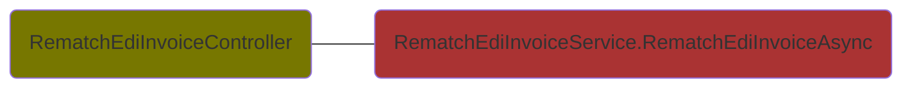
## ProviderInvoice.EdiInvoice.ManualIntervention.Reparse.InvoiceReparseService

## ProviderInvoice.EdiInvoice.ManualIntervention.Reprocess.InvoiceReprocessService
```mermaid
flowchart LR
    Dg.ProviderOrder.Infrastructure.Commands.ProviderInvoice.EdiInvoice.ManualIntervention.Reprocess.InvoiceReprocessController(InvoiceReprocessController):::primaryadapter --- Dg.ProviderOrder.Application.Commands.ProviderInvoice.EdiInvoice.ManualIntervention.Reprocess.InvoiceReprocessService(InvoiceReprocessService.ReprocessAsync):::primaryport
    Dg.ProviderOrder.Application.Commands.ProviderInvoice.EdiInvoice.ManualIntervention.Reprocess.InvoiceReprocessService(InvoiceReprocessService.ReprocessAsync):::primaryport --- Dg.ProviderOrderInterface.ServiceClient.IProviderOrderInterfaceServiceClient.ReimportInvoice_GetOrParseImportedInvoiceAsync_WebApi(ReimportInvoice_GetOrParseImportedInvoiceAsync):::webapicall
    classDef primaryport fill:#AA3333
    classDef primaryadapter fill:#777700
    classDef nservicebuspayload fill:#AAAA33
```
## ProviderInvoice.EdiInvoice.ManualIntervention.ResetForTesting.InvoiceResetForTestingService
```mermaid
flowchart LR
    Dg.ProviderOrder.Infrastructure.Commands.ProviderInvoice.EdiInvoice.ManualIntervention.ResetForTesting.InvoiceResetForTestingController(InvoiceResetForTestingController):::primaryadapter --- Dg.ProviderOrder.Application.Commands.ProviderInvoice.EdiInvoice.ManualIntervention.ResetForTesting.InvoiceResetForTestingService(InvoiceResetForTestingService.ResetForTestingAsync):::primaryport
    Dg.ProviderOrder.Application.Commands.ProviderInvoice.EdiInvoice.ManualIntervention.ResetForTesting.InvoiceResetForTestingService(InvoiceResetForTestingService.ResetForTestingAsync):::primaryport --- Dg.ProviderOrderInterface.ServiceClient.IProviderOrderInterfaceServiceClient.DeleteInvoiceParsing_DeleteInvoiceParsingResultAsync_WebApi(DeleteInvoiceParsing_DeleteInvoiceParsingResultAsync):::webapicall
    classDef primaryport fill:#AA3333
    classDef primaryadapter fill:#777700
    classDef nservicebuspayload fill:#AAAA33
```
## ProviderInvoice.EdiInvoice.ManualIntervention.ToggleCorrectable.InvoiceToggleCorrectableService


## ProviderResponse.CmiOrderResponse.ExpectedDeliveryDateUpdateService
```mermaid
flowchart LR
    Dg.ProviderOrder.Infrastructure.Queries.PurchaseOrderBacklogManager.UserInterface.PurchaseOrderBacklogManagerController(PurchaseOrderBacklogManagerController):::primaryadapter --- Dg.ProviderOrder.Application.Commands.ProviderResponse.CmiOrderResponse.ExpectedDeliveryDateUpdateService(ExpectedDeliveryDateUpdateService.ValidateAndUpdateExpectedDeliveryDateAsync):::primaryport
    Dg.ProviderOrder.Application.Commands.ProviderResponse.CmiOrderResponse.ExpectedDeliveryDateUpdateService(ExpectedDeliveryDateUpdateService.ValidateAndUpdateExpectedDeliveryDateAsync):::primaryport --- Dg.ProviderOrder.MessageContracts.DeliveryDate.V2.ExpectedDeliveryDateOfProviderForDirectDeliveryReceived_Outbox(ExpectedDeliveryDateOfProviderForDirectDeliveryReceived):::outboxpayload
    Dg.ProviderOrder.MessageContracts.DeliveryDate.V2.ExpectedDeliveryDateOfProviderForDirectDeliveryReceived_Outbox(ExpectedDeliveryDateOfProviderForDirectDeliveryReceived):::outboxpayload --- Dg.ProviderOrder.MessageContracts.DeliveryDate.V2.ExpectedDeliveryDateOfProviderForDirectDeliveryReceived_NServiceBus(ExpectedDeliveryDateOfProviderForDirectDeliveryReceived):::nservicebuspayload
    Dg.ProviderOrder.Application.Commands.ProviderResponse.CmiOrderResponse.ExpectedDeliveryDateUpdateService(ExpectedDeliveryDateUpdateService.ValidateAndUpdateExpectedDeliveryDateAsync):::primaryport --- Dg.ProviderOrder.MessageContracts.DeliveryDate.V1.ExpectedDeliveryDateOfProviderForWarehouseDeliveryReceived_Outbox(ExpectedDeliveryDateOfProviderForWarehouseDeliveryReceived):::outboxpayload
    Dg.ProviderOrder.MessageContracts.DeliveryDate.V1.ExpectedDeliveryDateOfProviderForWarehouseDeliveryReceived_Outbox(ExpectedDeliveryDateOfProviderForWarehouseDeliveryReceived):::outboxpayload --- ExpectedDeliveryDateOfProviderForWarehouseDeliveryReceived_NServiceBus(ExpectedDeliveryDateOfProviderForWarehouseDeliveryReceived):::nservicebuspayload
    classDef primaryport fill:#AA3333
    classDef primaryadapter fill:#777700
    classDef nservicebuspayload fill:#AAAA33
```
## ProviderResponse.EdiOrderResponse.ImportedOrderResponseProcessingService
```mermaid
flowchart LR
    Dg.ProviderOrder.Infrastructure.Commands.ProviderResponse.EdiOrderResponse.Reprocess.ReprocessController(ReprocessController):::primaryadapter --- Dg.ProviderOrder.Application.Commands.ProviderResponse.EdiOrderResponse.ImportedOrderResponseProcessingService(ImportedOrderResponseProcessingService.ProcessImportedOrderResponseAsync):::primaryport
    Dg.ProviderOrder.Application.Commands.ProviderResponse.EdiOrderResponse.ImportedOrderResponseProcessingService(ImportedOrderResponseProcessingService.ProcessImportedOrderResponseAsync):::primaryport --- Dg.ProviderOrder.MessageContracts.DeliveryDate.V2.ExpectedDeliveryDateOfProviderForDirectDeliveryReceived_Outbox(ExpectedDeliveryDateOfProviderForDirectDeliveryReceived):::outboxpayload
    Dg.ProviderOrder.MessageContracts.DeliveryDate.V2.ExpectedDeliveryDateOfProviderForDirectDeliveryReceived_Outbox(ExpectedDeliveryDateOfProviderForDirectDeliveryReceived):::outboxpayload --- Dg.ProviderOrder.MessageContracts.DeliveryDate.V2.ExpectedDeliveryDateOfProviderForDirectDeliveryReceived_NServiceBus(ExpectedDeliveryDateOfProviderForDirectDeliveryReceived):::nservicebuspayload
    Dg.ProviderOrder.Application.Commands.ProviderResponse.EdiOrderResponse.ImportedOrderResponseProcessingService(ImportedOrderResponseProcessingService.ProcessImportedOrderResponseAsync):::primaryport --- Dg.ProviderOrder.MessageContracts.DeliveryDate.V1.ExpectedDeliveryDateOfProviderForWarehouseDeliveryReceived_Outbox(ExpectedDeliveryDateOfProviderForWarehouseDeliveryReceived):::outboxpayload
    Dg.ProviderOrder.MessageContracts.DeliveryDate.V1.ExpectedDeliveryDateOfProviderForWarehouseDeliveryReceived_Outbox(ExpectedDeliveryDateOfProviderForWarehouseDeliveryReceived):::outboxpayload --- ExpectedDeliveryDateOfProviderForWarehouseDeliveryReceived_NServiceBus(ExpectedDeliveryDateOfProviderForWarehouseDeliveryReceived):::nservicebuspayload
    Dg.ProviderOrder.Application.Commands.ProviderResponse.EdiOrderResponse.ImportedOrderResponseProcessingService(ImportedOrderResponseProcessingService.ProcessImportedOrderResponseAsync):::primaryport --- Dg.ProviderOrderInterface.ServiceClient.IProviderOrderInterfaceServiceClient.ImportedOrderResponse_GetImportedOrderResponseAsync_WebApi(ImportedOrderResponse_GetImportedOrderResponseAsync):::webapicall
    classDef primaryport fill:#AA3333
    classDef primaryadapter fill:#777700
    classDef nservicebuspayload fill:#AAAA33
```
```mermaid
flowchart LR
    Dg.ProviderOrder.Infrastructure.Commands.ProviderResponse.EdiOrderResponse.ReprocessWithInput.ReprocessWithInputController(ReprocessWithInputController):::primaryadapter --- Dg.ProviderOrder.Application.Commands.ProviderResponse.EdiOrderResponse.ImportedOrderResponseProcessingService(ImportedOrderResponseProcessingService.ProcessOverridenImportedOrderResponseAsync):::primaryport
    Dg.ProviderOrder.Application.Commands.ProviderResponse.EdiOrderResponse.ImportedOrderResponseProcessingService(ImportedOrderResponseProcessingService.ProcessOverridenImportedOrderResponseAsync):::primaryport --- Dg.ProviderOrder.MessageContracts.DeliveryDate.V2.ExpectedDeliveryDateOfProviderForDirectDeliveryReceived_Outbox(ExpectedDeliveryDateOfProviderForDirectDeliveryReceived):::outboxpayload
    Dg.ProviderOrder.MessageContracts.DeliveryDate.V2.ExpectedDeliveryDateOfProviderForDirectDeliveryReceived_Outbox(ExpectedDeliveryDateOfProviderForDirectDeliveryReceived):::outboxpayload --- Dg.ProviderOrder.MessageContracts.DeliveryDate.V2.ExpectedDeliveryDateOfProviderForDirectDeliveryReceived_NServiceBus(ExpectedDeliveryDateOfProviderForDirectDeliveryReceived):::nservicebuspayload
    Dg.ProviderOrder.Application.Commands.ProviderResponse.EdiOrderResponse.ImportedOrderResponseProcessingService(ImportedOrderResponseProcessingService.ProcessOverridenImportedOrderResponseAsync):::primaryport --- Dg.ProviderOrder.MessageContracts.DeliveryDate.V1.ExpectedDeliveryDateOfProviderForWarehouseDeliveryReceived_Outbox(ExpectedDeliveryDateOfProviderForWarehouseDeliveryReceived):::outboxpayload
    Dg.ProviderOrder.MessageContracts.DeliveryDate.V1.ExpectedDeliveryDateOfProviderForWarehouseDeliveryReceived_Outbox(ExpectedDeliveryDateOfProviderForWarehouseDeliveryReceived):::outboxpayload --- ExpectedDeliveryDateOfProviderForWarehouseDeliveryReceived_NServiceBus(ExpectedDeliveryDateOfProviderForWarehouseDeliveryReceived):::nservicebuspayload
    classDef primaryport fill:#AA3333
    classDef primaryadapter fill:#777700
    classDef nservicebuspayload fill:#AAAA33
```
```mermaid
flowchart LR
        Dg.ProviderOrderInterface.MessageContracts.OrderResponseImport.V3.OrderResponseImported(OrderResponseImported):::primaryadapterpayload --- Dg.ProviderOrder.Infrastructure.Commands.ProviderResponse.EdiOrderResponse.OrderResponseImportedSubscriber(OrderResponseImportedSubscriber):::primaryadapter --- Dg.ProviderOrder.Application.Commands.ProviderResponse.EdiOrderResponse.ImportedOrderResponseProcessingService(ImportedOrderResponseProcessingService.ProcessImportedOrderResponseAsync):::primaryport
    Dg.ProviderOrder.Application.Commands.ProviderResponse.EdiOrderResponse.ImportedOrderResponseProcessingService(ImportedOrderResponseProcessingService.ProcessImportedOrderResponseAsync):::primaryport --- Dg.ProviderOrder.MessageContracts.DeliveryDate.V2.ExpectedDeliveryDateOfProviderForDirectDeliveryReceived_Outbox(ExpectedDeliveryDateOfProviderForDirectDeliveryReceived):::outboxpayload
    Dg.ProviderOrder.MessageContracts.DeliveryDate.V2.ExpectedDeliveryDateOfProviderForDirectDeliveryReceived_Outbox(ExpectedDeliveryDateOfProviderForDirectDeliveryReceived):::outboxpayload --- Dg.ProviderOrder.MessageContracts.DeliveryDate.V2.ExpectedDeliveryDateOfProviderForDirectDeliveryReceived_NServiceBus(ExpectedDeliveryDateOfProviderForDirectDeliveryReceived):::nservicebuspayload
    Dg.ProviderOrder.Application.Commands.ProviderResponse.EdiOrderResponse.ImportedOrderResponseProcessingService(ImportedOrderResponseProcessingService.ProcessImportedOrderResponseAsync):::primaryport --- Dg.ProviderOrder.MessageContracts.DeliveryDate.V1.ExpectedDeliveryDateOfProviderForWarehouseDeliveryReceived_Outbox(ExpectedDeliveryDateOfProviderForWarehouseDeliveryReceived):::outboxpayload
    Dg.ProviderOrder.MessageContracts.DeliveryDate.V1.ExpectedDeliveryDateOfProviderForWarehouseDeliveryReceived_Outbox(ExpectedDeliveryDateOfProviderForWarehouseDeliveryReceived):::outboxpayload --- ExpectedDeliveryDateOfProviderForWarehouseDeliveryReceived_NServiceBus(ExpectedDeliveryDateOfProviderForWarehouseDeliveryReceived):::nservicebuspayload
    classDef primaryport fill:#AA3333
    classDef primaryadapter fill:#777700
    classDef nservicebuspayload fill:#AAAA33
```
## ProviderResponse.EdiOrderResponse.ToggleCorrectable.OrderResponseToggleCorrectableService


## Cancellation.CancelRequestFeature.RequestCancellationHandler
```mermaid
flowchart LR
        Dg.ProviderOrder.MessageContracts.Cancellation.V1.RequestCancellation(RequestCancellation):::primaryadapterpayload --- Dg.ProviderOrder.Infrastructure.Commands.Cancellation.CancelRequestFeature.RequestCancellationReceiver(RequestCancellationReceiver):::primaryadapter --- Dg.ProviderOrder.Application.Commands.Cancellation.CancelRequestFeature.RequestCancellationHandler(RequestCancellationHandler.HandleRequestCancellationAsync):::primaryport
    Dg.ProviderOrder.Application.Commands.Cancellation.CancelRequestFeature.RequestCancellationHandler(RequestCancellationHandler.HandleRequestCancellationAsync):::primaryport --- Dg.ProviderOrder.Infrastructure.Commands.Cancellation.CancelRequestFeature.FollowupCancelRequestStatus4Outbox_Outbox(FollowupCancelRequestStatus4Outbox):::outboxpayload
    Dg.ProviderOrder.Infrastructure.Commands.Cancellation.CancelRequestFeature.FollowupCancelRequestStatus4Outbox_Outbox(FollowupCancelRequestStatus4Outbox):::outboxpayload --- FollowupCancelRequestStatus_NServiceBus(FollowupCancelRequestStatus):::nservicebuspayload
    Dg.ProviderOrder.Application.Commands.Cancellation.CancelRequestFeature.RequestCancellationHandler(RequestCancellationHandler.HandleRequestCancellationAsync):::primaryport --- Dg.ProviderOrderInterface.MessageContracts.CancelRequestExport.V1.ExportCancelRequest_Outbox(ExportCancelRequest):::outboxpayload
    Dg.ProviderOrderInterface.MessageContracts.CancelRequestExport.V1.ExportCancelRequest_Outbox(ExportCancelRequest):::outboxpayload --- ExportCancelRequest_NServiceBus(ExportCancelRequest):::nservicebuspayload
    classDef primaryport fill:#AA3333
    classDef primaryadapter fill:#777700
    classDef nservicebuspayload fill:#AAAA33
```
## Cancellation.CancelRequestFollowupCheckFeature.CancelRequestFollowupCheckService
```mermaid
flowchart LR
        Dg.ProviderOrder.MessageContracts.Cancellation.V1.FollowupCancelRequestStatus(FollowupCancelRequestStatus):::primaryadapterpayload --- Dg.ProviderOrder.Infrastructure.Commands.Cancellation.CancelRequestFollowupCheckFeature.FollowupCancelRequestStatusHandler(FollowupCancelRequestStatusHandler):::primaryadapter --- Dg.ProviderOrder.Application.Commands.Cancellation.CancelRequestFollowupCheckFeature.CancelRequestFollowupCheckService(CancelRequestFollowupCheckService.UpdateCancelRequestFollowupCheckAndCancelItemsIfNecessaryAsync):::primaryport
    Dg.ProviderOrder.Application.Commands.Cancellation.CancelRequestFollowupCheckFeature.CancelRequestFollowupCheckService(CancelRequestFollowupCheckService.UpdateCancelRequestFollowupCheckAndCancelItemsIfNecessaryAsync):::primaryport --- Dg.ProviderOrder.MessageContracts.Cancellation.V1.CancelItemsByMandator_Outbox(CancelItemsByMandator):::outboxpayload
    Dg.ProviderOrder.MessageContracts.Cancellation.V1.CancelItemsByMandator_Outbox(CancelItemsByMandator):::outboxpayload --- CancelItemsByMandator_NServiceBus(CancelItemsByMandator):::nservicebuspayload
    classDef primaryport fill:#AA3333
    classDef primaryadapter fill:#777700
    classDef nservicebuspayload fill:#AAAA33
```
## Cancellation.InvoicedButNotDeliveredFeature.InvoicedButNotDeliveredProviderOrderItemCancellationService
```mermaid
flowchart LR
        Dg.ProviderOrder.MessageContracts.Cancellation.V2.CleanupInvoicedButNotDelivered.CancelItemForCleanup(CancelItemForCleanup):::primaryadapterpayload --- Dg.ProviderOrder.Infrastructure.Commands.Cancellation.InvoicedButNotDeliveredFeature.CancelItemForCleanupCommandReceiver(CancelItemForCleanupCommandReceiver):::primaryadapter --- Dg.ProviderOrder.Application.Commands.Cancellation.InvoicedButNotDeliveredFeature.InvoicedButNotDeliveredProviderOrderItemCancellationService(InvoicedButNotDeliveredProviderOrderItemCancellationService.CancelAndReportProviderOrderItemAsync):::primaryport
    classDef primaryport fill:#AA3333
    classDef primaryadapter fill:#777700
    classDef nservicebuspayload fill:#AAAA33
```
## Cancellation.ProviderCancellation.Edi.ImportedProviderCancelNotification.ProcessingService
```mermaid
flowchart LR
        Dg.ProviderOrderInterface.MessageContracts.ProviderCancelNotificationImport.V1.ProviderCancelNotificationImported(ProviderCancelNotificationImported):::primaryadapterpayload --- Dg.ProviderOrder.Infrastructure.Commands.Cancellation.ProviderCancellation.Edi.ImportedProviderCancelNotification.ProviderCancelNotificationImportedSubscriber(ProviderCancelNotificationImportedSubscriber):::primaryadapter --- Dg.ProviderOrder.Application.Commands.Cancellation.ProviderCancellation.Edi.ImportedProviderCancelNotification.ProcessingService(ProcessingService.ProcessImportedProviderCancelNotificationAsync):::primaryport
    Dg.ProviderOrder.Application.Commands.Cancellation.ProviderCancellation.Edi.ImportedProviderCancelNotification.ProcessingService(ProcessingService.ProcessImportedProviderCancelNotificationAsync):::primaryport --- Dg.ProviderOrder.MessageContracts.Cancellation.V1.MarketplaceOrderItemCancelled_Outbox(MarketplaceOrderItemCancelled):::outboxpayload
    Dg.ProviderOrder.MessageContracts.Cancellation.V1.MarketplaceOrderItemCancelled_Outbox(MarketplaceOrderItemCancelled):::outboxpayload --- MessageContracts.Cancellation.V1.MarketplaceOrderItemCancelled_NServiceBus(MarketplaceOrderItemCancelled):::nservicebuspayload
    Dg.ProviderOrder.Application.Commands.Cancellation.ProviderCancellation.Edi.ImportedProviderCancelNotification.ProcessingService(ProcessingService.ProcessImportedProviderCancelNotificationAsync):::primaryport --- Dg.ProviderOrder.MessageContracts.Cancellation.V1.RetailDirectDeliveryOrderItemsCancelledByProvider_Outbox(RetailDirectDeliveryOrderItemsCancelledByProvider):::outboxpayload
    Dg.ProviderOrder.MessageContracts.Cancellation.V1.RetailDirectDeliveryOrderItemsCancelledByProvider_Outbox(RetailDirectDeliveryOrderItemsCancelledByProvider):::outboxpayload --- RetailDirectDeliveryOrderItemsCancelledByProvider_NServiceBus(RetailDirectDeliveryOrderItemsCancelledByProvider):::nservicebuspayload
    Dg.ProviderOrder.Application.Commands.Cancellation.ProviderCancellation.Edi.ImportedProviderCancelNotification.ProcessingService(ProcessingService.ProcessImportedProviderCancelNotificationAsync):::primaryport --- Dg.ProviderOrder.MessageContracts.Cancellation.V1.UnlinkItemProductStaticsFromRmaItemProducts_Outbox(UnlinkItemProductStaticsFromRmaItemProducts):::outboxpayload
    Dg.ProviderOrder.MessageContracts.Cancellation.V1.UnlinkItemProductStaticsFromRmaItemProducts_Outbox(UnlinkItemProductStaticsFromRmaItemProducts):::outboxpayload --- UnlinkItemProductStaticsFromRmaItemProducts_NServiceBus(UnlinkItemProductStaticsFromRmaItemProducts):::nservicebuspayload
    Dg.ProviderOrder.Application.Commands.Cancellation.ProviderCancellation.Edi.ImportedProviderCancelNotification.ProcessingService(ProcessingService.ProcessImportedProviderCancelNotificationAsync):::primaryport --- Dg.ProviderOrder.MessageContracts.Cancellation.V1.RetailWarehouseDeliveryOrderItemCancelledByProvider_Outbox(RetailWarehouseDeliveryOrderItemCancelledByProvider):::outboxpayload
    Dg.ProviderOrder.MessageContracts.Cancellation.V1.RetailWarehouseDeliveryOrderItemCancelledByProvider_Outbox(RetailWarehouseDeliveryOrderItemCancelledByProvider):::outboxpayload --- RetailWarehouseDeliveryOrderItemCancelledByProvider_NServiceBus(RetailWarehouseDeliveryOrderItemCancelledByProvider):::nservicebuspayload
    Dg.ProviderOrder.Application.Commands.Cancellation.ProviderCancellation.Edi.ImportedProviderCancelNotification.ProcessingService(ProcessingService.ProcessImportedProviderCancelNotificationAsync):::primaryport --- Dg.ProviderOrder.MessageContracts.Cancellation.V1.CancelDeliveryNotePositions_Outbox(CancelDeliveryNotePositions):::outboxpayload
    Dg.ProviderOrder.MessageContracts.Cancellation.V1.CancelDeliveryNotePositions_Outbox(CancelDeliveryNotePositions):::outboxpayload --- CancelDeliveryNotePositions_NServiceBus(CancelDeliveryNotePositions):::nservicebuspayload
    Dg.ProviderOrder.Application.Commands.Cancellation.ProviderCancellation.Edi.ImportedProviderCancelNotification.ProcessingService(ProcessingService.ProcessImportedProviderCancelNotificationAsync):::primaryport --- Dg.ProviderOrder.MessageContracts.Cancellation.V1.ProviderOrderPositionsCancelledByProvider_Outbox(ProviderOrderPositionsCancelledByProvider):::outboxpayload
    Dg.ProviderOrder.MessageContracts.Cancellation.V1.ProviderOrderPositionsCancelledByProvider_Outbox(ProviderOrderPositionsCancelledByProvider):::outboxpayload --- ProviderOrderPositionsCancelledByProvider_NServiceBus(ProviderOrderPositionsCancelledByProvider):::nservicebuspayload
    classDef primaryport fill:#AA3333
    classDef primaryadapter fill:#777700
    classDef nservicebuspayload fill:#AAAA33
```
## Cancellation.ProviderCancellation.ProviderResponseCancellation.UnconfirmedDirectDeliveryItemsCancellationService
```mermaid
flowchart LR
        Dg.ProviderOrder.MessageContracts.DeliveryDate.V2.ExpectedDeliveryDateOfProviderForDirectDeliveryReceived(ExpectedDeliveryDateOfProviderForDirectDeliveryReceived):::primaryadapterpayload --- Dg.ProviderOrder.Infrastructure.Commands.Cancellation.ProviderCancellation.ProviderResponseCancellation.UnconfirmedDirectDeliveryItemsCancellationSubscriber(UnconfirmedDirectDeliveryItemsCancellationSubscriber):::primaryadapter --- Dg.ProviderOrder.Application.Commands.Cancellation.ProviderCancellation.ProviderResponseCancellation.UnconfirmedDirectDeliveryItemsCancellationService(UnconfirmedDirectDeliveryItemsCancellationService.CancelUnconfirmedItemsAsync):::primaryport
    Dg.ProviderOrder.Application.Commands.Cancellation.ProviderCancellation.ProviderResponseCancellation.UnconfirmedDirectDeliveryItemsCancellationService(UnconfirmedDirectDeliveryItemsCancellationService.CancelUnconfirmedItemsAsync):::primaryport --- Dg.ProviderOrder.MessageContracts.Cancellation.V1.MarketplaceOrderItemCancelled_Outbox(MarketplaceOrderItemCancelled):::outboxpayload
    Dg.ProviderOrder.MessageContracts.Cancellation.V1.MarketplaceOrderItemCancelled_Outbox(MarketplaceOrderItemCancelled):::outboxpayload --- MessageContracts.Cancellation.V1.MarketplaceOrderItemCancelled_NServiceBus(MarketplaceOrderItemCancelled):::nservicebuspayload
    Dg.ProviderOrder.Application.Commands.Cancellation.ProviderCancellation.ProviderResponseCancellation.UnconfirmedDirectDeliveryItemsCancellationService(UnconfirmedDirectDeliveryItemsCancellationService.CancelUnconfirmedItemsAsync):::primaryport --- Dg.ProviderOrder.MessageContracts.Cancellation.V1.RetailDirectDeliveryOrderItemsCancelledByProvider_Outbox(RetailDirectDeliveryOrderItemsCancelledByProvider):::outboxpayload
    Dg.ProviderOrder.MessageContracts.Cancellation.V1.RetailDirectDeliveryOrderItemsCancelledByProvider_Outbox(RetailDirectDeliveryOrderItemsCancelledByProvider):::outboxpayload --- RetailDirectDeliveryOrderItemsCancelledByProvider_NServiceBus(RetailDirectDeliveryOrderItemsCancelledByProvider):::nservicebuspayload
    Dg.ProviderOrder.Application.Commands.Cancellation.ProviderCancellation.ProviderResponseCancellation.UnconfirmedDirectDeliveryItemsCancellationService(UnconfirmedDirectDeliveryItemsCancellationService.CancelUnconfirmedItemsAsync):::primaryport --- Dg.ProviderOrder.MessageContracts.Cancellation.V1.UnlinkItemProductStaticsFromRmaItemProducts_Outbox(UnlinkItemProductStaticsFromRmaItemProducts):::outboxpayload
    Dg.ProviderOrder.MessageContracts.Cancellation.V1.UnlinkItemProductStaticsFromRmaItemProducts_Outbox(UnlinkItemProductStaticsFromRmaItemProducts):::outboxpayload --- UnlinkItemProductStaticsFromRmaItemProducts_NServiceBus(UnlinkItemProductStaticsFromRmaItemProducts):::nservicebuspayload
    Dg.ProviderOrder.Application.Commands.Cancellation.ProviderCancellation.ProviderResponseCancellation.UnconfirmedDirectDeliveryItemsCancellationService(UnconfirmedDirectDeliveryItemsCancellationService.CancelUnconfirmedItemsAsync):::primaryport --- Dg.ProviderOrder.MessageContracts.Cancellation.V1.CancelDeliveryNotePositions_Outbox(CancelDeliveryNotePositions):::outboxpayload
    Dg.ProviderOrder.MessageContracts.Cancellation.V1.CancelDeliveryNotePositions_Outbox(CancelDeliveryNotePositions):::outboxpayload --- CancelDeliveryNotePositions_NServiceBus(CancelDeliveryNotePositions):::nservicebuspayload
    Dg.ProviderOrder.Application.Commands.Cancellation.ProviderCancellation.ProviderResponseCancellation.UnconfirmedDirectDeliveryItemsCancellationService(UnconfirmedDirectDeliveryItemsCancellationService.CancelUnconfirmedItemsAsync):::primaryport --- Dg.ProviderOrder.MessageContracts.Cancellation.V1.ProviderOrderPositionsCancelledByProvider_Outbox(ProviderOrderPositionsCancelledByProvider):::outboxpayload
    Dg.ProviderOrder.MessageContracts.Cancellation.V1.ProviderOrderPositionsCancelledByProvider_Outbox(ProviderOrderPositionsCancelledByProvider):::outboxpayload --- ProviderOrderPositionsCancelledByProvider_NServiceBus(ProviderOrderPositionsCancelledByProvider):::nservicebuspayload
    classDef primaryport fill:#AA3333
    classDef primaryadapter fill:#777700
    classDef nservicebuspayload fill:#AAAA33
```
## Cancellation.ProviderCancellation.ProviderResponseCancellation.UnconfirmedWarehouseDeliveryItemsCancellationService
```mermaid
flowchart LR
        Dg.ProviderOrder.MessageContracts.DeliveryDate.V1.ExpectedDeliveryDateOfProviderForWarehouseDeliveryReceived(ExpectedDeliveryDateOfProviderForWarehouseDeliveryReceived):::primaryadapterpayload --- Dg.ProviderOrder.Infrastructure.Commands.Cancellation.ProviderCancellation.ProviderResponseCancellation.UnconfirmedWarehouseDeliveryItemsCancellationSubscriber(UnconfirmedWarehouseDeliveryItemsCancellationSubscriber):::primaryadapter --- Dg.ProviderOrder.Application.Commands.Cancellation.ProviderCancellation.ProviderResponseCancellation.UnconfirmedWarehouseDeliveryItemsCancellationService(UnconfirmedWarehouseDeliveryItemsCancellationService.CancelUnconfirmedItemsAsync):::primaryport
    Dg.ProviderOrder.Application.Commands.Cancellation.ProviderCancellation.ProviderResponseCancellation.UnconfirmedWarehouseDeliveryItemsCancellationService(UnconfirmedWarehouseDeliveryItemsCancellationService.CancelUnconfirmedItemsAsync):::primaryport --- Dg.ProviderOrder.MessageContracts.Cancellation.V1.UnlinkItemProductStaticsFromRmaItemProducts_Outbox(UnlinkItemProductStaticsFromRmaItemProducts):::outboxpayload
    Dg.ProviderOrder.MessageContracts.Cancellation.V1.UnlinkItemProductStaticsFromRmaItemProducts_Outbox(UnlinkItemProductStaticsFromRmaItemProducts):::outboxpayload --- UnlinkItemProductStaticsFromRmaItemProducts_NServiceBus(UnlinkItemProductStaticsFromRmaItemProducts):::nservicebuspayload
    Dg.ProviderOrder.Application.Commands.Cancellation.ProviderCancellation.ProviderResponseCancellation.UnconfirmedWarehouseDeliveryItemsCancellationService(UnconfirmedWarehouseDeliveryItemsCancellationService.CancelUnconfirmedItemsAsync):::primaryport --- Dg.ProviderOrder.MessageContracts.Cancellation.V1.RetailWarehouseDeliveryOrderItemCancelledByProvider_Outbox(RetailWarehouseDeliveryOrderItemCancelledByProvider):::outboxpayload
    Dg.ProviderOrder.MessageContracts.Cancellation.V1.RetailWarehouseDeliveryOrderItemCancelledByProvider_Outbox(RetailWarehouseDeliveryOrderItemCancelledByProvider):::outboxpayload --- RetailWarehouseDeliveryOrderItemCancelledByProvider_NServiceBus(RetailWarehouseDeliveryOrderItemCancelledByProvider):::nservicebuspayload
    Dg.ProviderOrder.Application.Commands.Cancellation.ProviderCancellation.ProviderResponseCancellation.UnconfirmedWarehouseDeliveryItemsCancellationService(UnconfirmedWarehouseDeliveryItemsCancellationService.CancelUnconfirmedItemsAsync):::primaryport --- Dg.ProviderOrder.MessageContracts.Cancellation.V1.CancelDeliveryNotePositions_Outbox(CancelDeliveryNotePositions):::outboxpayload
    Dg.ProviderOrder.MessageContracts.Cancellation.V1.CancelDeliveryNotePositions_Outbox(CancelDeliveryNotePositions):::outboxpayload --- CancelDeliveryNotePositions_NServiceBus(CancelDeliveryNotePositions):::nservicebuspayload
    Dg.ProviderOrder.Application.Commands.Cancellation.ProviderCancellation.ProviderResponseCancellation.UnconfirmedWarehouseDeliveryItemsCancellationService(UnconfirmedWarehouseDeliveryItemsCancellationService.CancelUnconfirmedItemsAsync):::primaryport --- Dg.ProviderOrder.MessageContracts.Cancellation.V1.ProviderOrderPositionsCancelledByProvider_Outbox(ProviderOrderPositionsCancelledByProvider):::outboxpayload
    Dg.ProviderOrder.MessageContracts.Cancellation.V1.ProviderOrderPositionsCancelledByProvider_Outbox(ProviderOrderPositionsCancelledByProvider):::outboxpayload --- ProviderOrderPositionsCancelledByProvider_NServiceBus(ProviderOrderPositionsCancelledByProvider):::nservicebuspayload
    classDef primaryport fill:#AA3333
    classDef primaryadapter fill:#777700
    classDef nservicebuspayload fill:#AAAA33
```
## Cancellation.UnattendedBacklogCleanup.CheckLifetime.Creation.UnattendedBacklogCheckCreationService
```mermaid
flowchart LR
        Dg.ProviderOrder.MessageContracts.OrderExport.V2.WarehouseOrderExported(WarehouseOrderExported):::primaryadapterpayload --- Dg.ProviderOrder.Infrastructure.Commands.Cancellation.UnattendedBacklogCleanup.CheckLifetime.Creation.WarehouseOrderExportedSubscriber(WarehouseOrderExportedSubscriber):::primaryadapter --- Dg.ProviderOrder.Application.Commands.Cancellation.UnattendedBacklogCleanup.CheckLifetime.Creation.UnattendedBacklogCheckCreationService(UnattendedBacklogCheckCreationService.CreateUnattendedBacklogChecksIfNecessaryAsync):::primaryport
    Dg.ProviderOrder.Application.Commands.Cancellation.UnattendedBacklogCleanup.CheckLifetime.Creation.UnattendedBacklogCheckCreationService(UnattendedBacklogCheckCreationService.CreateUnattendedBacklogChecksIfNecessaryAsync):::primaryport --- Dg.ProviderOrder.Infrastructure.Commands.Cancellation.UnattendedBacklogCleanup.CheckIfProviderOrderItemsAreUnattendedOutboxDataSet_Outbox(CheckIfProviderOrderItemsAreUnattendedOutboxDataSet):::outboxpayload
    Dg.ProviderOrder.Infrastructure.Commands.Cancellation.UnattendedBacklogCleanup.CheckIfProviderOrderItemsAreUnattendedOutboxDataSet_Outbox(CheckIfProviderOrderItemsAreUnattendedOutboxDataSet):::outboxpayload --- CheckIfProviderOrderItemsAreUnattended_NServiceBus(CheckIfProviderOrderItemsAreUnattended):::nservicebuspayload
    classDef primaryport fill:#AA3333
    classDef primaryadapter fill:#777700
    classDef nservicebuspayload fill:#AAAA33
```
## Cancellation.UnattendedBacklogCleanup.CheckLifetime.Reset.UnattendedBacklogCheckResetService
```mermaid
flowchart LR
        Dg.ProviderOrder.MessageContracts.DeliveryDate.V1.ExpectedDeliveryDateOfProviderForWarehouseDeliveryReceived(ExpectedDeliveryDateOfProviderForWarehouseDeliveryReceived):::primaryadapterpayload --- Dg.ProviderOrder.Infrastructure.Commands.Cancellation.UnattendedBacklogCleanup.CheckLifetime.Reset.UnattendedBacklogCheckResetSubscriber(UnattendedBacklogCheckResetSubscriber):::primaryadapter --- Dg.ProviderOrder.Application.Commands.Cancellation.UnattendedBacklogCleanup.CheckLifetime.Reset.UnattendedBacklogCheckResetService(UnattendedBacklogCheckResetService.ResetWarehouseDeliveryUnattendedBacklogChecksAsync):::primaryport
    Dg.ProviderOrder.Application.Commands.Cancellation.UnattendedBacklogCleanup.CheckLifetime.Reset.UnattendedBacklogCheckResetService(UnattendedBacklogCheckResetService.ResetWarehouseDeliveryUnattendedBacklogChecksAsync):::primaryport --- Dg.ProviderOrder.Infrastructure.Commands.Cancellation.UnattendedBacklogCleanup.CheckIfProviderOrderItemsAreUnattendedOutboxDataSet_Outbox(CheckIfProviderOrderItemsAreUnattendedOutboxDataSet):::outboxpayload
    Dg.ProviderOrder.Infrastructure.Commands.Cancellation.UnattendedBacklogCleanup.CheckIfProviderOrderItemsAreUnattendedOutboxDataSet_Outbox(CheckIfProviderOrderItemsAreUnattendedOutboxDataSet):::outboxpayload --- CheckIfProviderOrderItemsAreUnattended_NServiceBus(CheckIfProviderOrderItemsAreUnattended):::nservicebuspayload
    classDef primaryport fill:#AA3333
    classDef primaryadapter fill:#777700
    classDef nservicebuspayload fill:#AAAA33
```
## Cancellation.UnattendedBacklogCleanup.CheckUnattendedItemsService
```mermaid
flowchart LR
        Dg.ProviderOrder.MessageContracts.Cancellation.V1.CheckIfProviderOrderItemsAreUnattended(CheckIfProviderOrderItemsAreUnattended):::primaryadapterpayload --- Dg.ProviderOrder.Infrastructure.Commands.Cancellation.UnattendedBacklogCleanup.CheckIfProviderOrderItemsAreUnattendedCommandReceiver(CheckIfProviderOrderItemsAreUnattendedCommandReceiver):::primaryadapter --- Dg.ProviderOrder.Application.Commands.Cancellation.UnattendedBacklogCleanup.CheckUnattendedItemsService(CheckUnattendedItemsService.CheckUnattendedItemsAsync):::primaryport
    Dg.ProviderOrder.Application.Commands.Cancellation.UnattendedBacklogCleanup.CheckUnattendedItemsService(CheckUnattendedItemsService.CheckUnattendedItemsAsync):::primaryport --- Dg.ProviderOrder.MessageContracts.Cancellation.V1.UnattendedRetailWarehousePositionsDetected_Outbox(UnattendedRetailWarehousePositionsDetected):::outboxpayload
    Dg.ProviderOrder.MessageContracts.Cancellation.V1.UnattendedRetailWarehousePositionsDetected_Outbox(UnattendedRetailWarehousePositionsDetected):::outboxpayload --- UnattendedRetailWarehousePositionsDetected_NServiceBus(UnattendedRetailWarehousePositionsDetected):::nservicebuspayload
    Dg.ProviderOrder.Application.Commands.Cancellation.UnattendedBacklogCleanup.CheckUnattendedItemsService(CheckUnattendedItemsService.CheckUnattendedItemsAsync):::primaryport --- Dg.ProviderOrder.Infrastructure.Commands.Cancellation.UnattendedBacklogCleanup.CreateCancelRequestsForUnattendedItems4Outbox_Outbox(CreateCancelRequestsForUnattendedItems4Outbox):::outboxpayload
    Dg.ProviderOrder.Infrastructure.Commands.Cancellation.UnattendedBacklogCleanup.CreateCancelRequestsForUnattendedItems4Outbox_Outbox(CreateCancelRequestsForUnattendedItems4Outbox):::outboxpayload --- CreateCancelRequestsForUnattendedItems_NServiceBus(CreateCancelRequestsForUnattendedItems):::nservicebuspayload
    classDef primaryport fill:#AA3333
    classDef primaryadapter fill:#777700
    classDef nservicebuspayload fill:#AAAA33
```
## Cancellation.UnattendedBacklogCleanup.CreateCancelRequestsForUnattendedItemsService
```mermaid
flowchart LR
        Dg.ProviderOrder.MessageContracts.Cancellation.V1.CreateCancelRequestsForUnattendedItems(CreateCancelRequestsForUnattendedItems):::primaryadapterpayload --- Dg.ProviderOrder.Infrastructure.Commands.Cancellation.UnattendedBacklogCleanup.CreateCancelRequestsForUnattendedItemsCommandReceiver(CreateCancelRequestsForUnattendedItemsCommandReceiver):::primaryadapter --- Dg.ProviderOrder.Application.Commands.Cancellation.UnattendedBacklogCleanup.CreateCancelRequestsForUnattendedItemsService(CreateCancelRequestsForUnattendedItemsService.CreateCancelRequestsForUnattendedItemsAsync):::primaryport
    Dg.ProviderOrder.Application.Commands.Cancellation.UnattendedBacklogCleanup.CreateCancelRequestsForUnattendedItemsService(CreateCancelRequestsForUnattendedItemsService.CreateCancelRequestsForUnattendedItemsAsync):::primaryport --- Dg.ProviderOrder.MessageContracts.Cancellation.V1.RequestCancellation_Outbox(RequestCancellation):::outboxpayload
    Dg.ProviderOrder.MessageContracts.Cancellation.V1.RequestCancellation_Outbox(RequestCancellation):::outboxpayload --- RequestCancellation_NServiceBus(RequestCancellation):::nservicebuspayload
    Dg.ProviderOrder.Application.Commands.Cancellation.UnattendedBacklogCleanup.CreateCancelRequestsForUnattendedItemsService(CreateCancelRequestsForUnattendedItemsService.CreateCancelRequestsForUnattendedItemsAsync):::primaryport --- Dg.ProviderOrder.Infrastructure.Commands.Cancellation.UnattendedBacklogCleanup.CreateCancelRequestsForUnattendedItems4Outbox_Outbox(CreateCancelRequestsForUnattendedItems4Outbox):::outboxpayload
    Dg.ProviderOrder.Infrastructure.Commands.Cancellation.UnattendedBacklogCleanup.CreateCancelRequestsForUnattendedItems4Outbox_Outbox(CreateCancelRequestsForUnattendedItems4Outbox):::outboxpayload --- CreateCancelRequestsForUnattendedItems_NServiceBus(CreateCancelRequestsForUnattendedItems):::nservicebuspayload
    classDef primaryport fill:#AA3333
    classDef primaryadapter fill:#777700
    classDef nservicebuspayload fill:#AAAA33
```
## CustomerReturnRegistrationFeature.ReturnCaseCreatedOrchestrationService
```mermaid
flowchart LR
        Dg.NonDefectiveArticles.Contracts.ReturnsHandling.MessageContracts.V3.ReturnCaseCreated(ReturnCaseCreated):::primaryadapterpayload --- Dg.ProviderOrder.Infrastructure.Commands.CustomerReturnRegistrationFeature.ReturnCaseCreatedReceiver(ReturnCaseCreatedReceiver):::primaryadapter --- Dg.ProviderOrder.Application.Commands.CustomerReturnRegistrationFeature.ReturnCaseCreatedOrchestrationService(ReturnCaseCreatedOrchestrationService.HandleReturnCaseCreatedAsync):::primaryport
    Dg.ProviderOrder.Application.Commands.CustomerReturnRegistrationFeature.ReturnCaseCreatedOrchestrationService(ReturnCaseCreatedOrchestrationService.HandleReturnCaseCreatedAsync):::primaryport --- Dg.ProviderOrderInterface.MessageContracts.CustomerReturnRegistrationExport.V1.ExportCustomerReturnRegistration_Outbox(ExportCustomerReturnRegistration):::outboxpayload
    Dg.ProviderOrderInterface.MessageContracts.CustomerReturnRegistrationExport.V1.ExportCustomerReturnRegistration_Outbox(ExportCustomerReturnRegistration):::outboxpayload --- ExportCustomerReturnRegistration_NServiceBus(ExportCustomerReturnRegistration):::nservicebuspayload
    classDef primaryport fill:#AA3333
    classDef primaryadapter fill:#777700
    classDef nservicebuspayload fill:#AAAA33
```
## OrderCreation.MarketplaceDirectDelivery.MarketplaceDirectDeliveryOrderCreationService
```mermaid
flowchart LR
        Dg.ProviderOrder.MessageContracts.OrderCreation.MarketplaceDelivery.V1.CreateMarketplaceDirectDeliveryProviderOrder(CreateMarketplaceDirectDeliveryProviderOrder):::primaryadapterpayload --- Dg.ProviderOrder.Infrastructure.Commands.OrderCreation.MarketplaceDirectDelivery.CreateMarketplaceDirectDeliveryProviderOrderReceiver(CreateMarketplaceDirectDeliveryProviderOrderReceiver):::primaryadapter --- Dg.ProviderOrder.Application.Commands.OrderCreation.MarketplaceDirectDelivery.MarketplaceDirectDeliveryOrderCreationService(MarketplaceDirectDeliveryOrderCreationService.CreateAndExportOrderAsync):::primaryport
    Dg.ProviderOrder.Application.Commands.OrderCreation.MarketplaceDirectDelivery.MarketplaceDirectDeliveryOrderCreationService(MarketplaceDirectDeliveryOrderCreationService.CreateAndExportOrderAsync):::primaryport --- Dg.ProviderOrder.MessageContracts.OrderExport.V1.ExportOrder_Outbox(ExportOrder):::outboxpayload
    Dg.ProviderOrder.MessageContracts.OrderExport.V1.ExportOrder_Outbox(ExportOrder):::outboxpayload --- Dg.ProviderOrder.MessageContracts.OrderExport.V1.ExportOrder_NServiceBus(ExportOrder):::nservicebuspayload
    classDef primaryport fill:#AA3333
    classDef primaryadapter fill:#777700
    classDef nservicebuspayload fill:#AAAA33
```
## OrderCreation.RetailDirectDelivery.StandardRetailDirectDelivery.RetailDirectDeliveryOrderCreationService
```mermaid
flowchart LR
        Dg.ProviderOrder.MessageContracts.OrderCreation.DirectDelivery.V1.CreateRetailDirectDeliveryProviderOrder(CreateRetailDirectDeliveryProviderOrder):::primaryadapterpayload --- Dg.ProviderOrder.Infrastructure.Commands.OrderCreation.RetailDirectDelivery.StandardRetailDirectDelivery.CreateRetailDirectDeliveryProviderOrderReceiver(CreateRetailDirectDeliveryProviderOrderReceiver):::primaryadapter --- Dg.ProviderOrder.Application.Commands.OrderCreation.RetailDirectDelivery.StandardRetailDirectDelivery.RetailDirectDeliveryOrderCreationService(RetailDirectDeliveryOrderCreationService.CreateAndExportOrderAsync):::primaryport
    Dg.ProviderOrder.Application.Commands.OrderCreation.RetailDirectDelivery.StandardRetailDirectDelivery.RetailDirectDeliveryOrderCreationService(RetailDirectDeliveryOrderCreationService.CreateAndExportOrderAsync):::primaryport --- Dg.ProviderOrder.MessageContracts.OrderExport.V1.ExportOrder_Outbox(ExportOrder):::outboxpayload
    Dg.ProviderOrder.MessageContracts.OrderExport.V1.ExportOrder_Outbox(ExportOrder):::outboxpayload --- Dg.ProviderOrder.MessageContracts.OrderExport.V1.ExportOrder_NServiceBus(ExportOrder):::nservicebuspayload
    classDef primaryport fill:#AA3333
    classDef primaryadapter fill:#777700
    classDef nservicebuspayload fill:#AAAA33
```
## OrderCreation.RetailWarehouseDelivery.InterMandator.BuyerMandator.InterMandatorOrderConfirmationService
```mermaid
flowchart LR
        Dg.SalesOrder.V1.InterMandatorSalesOrderCreated(InterMandatorSalesOrderCreated):::primaryadapterpayload --- Dg.ProviderOrder.Infrastructure.Commands.OrderCreation.RetailWarehouseDelivery.InterMandator.BuyerMandator.InterMandatorSalesOrderCreatedSubscriber(InterMandatorSalesOrderCreatedSubscriber):::primaryadapter --- Dg.ProviderOrder.Application.Commands.OrderCreation.RetailWarehouseDelivery.InterMandator.BuyerMandator.InterMandatorOrderConfirmationService(InterMandatorOrderConfirmationService.SetSalesOrderIdAndConfirmOrderAsync):::primaryport
    classDef primaryport fill:#AA3333
    classDef primaryadapter fill:#777700
    classDef nservicebuspayload fill:#AAAA33
```
## OrderCreation.RetailWarehouseDelivery.InterMandator.BuyerMandator.InterMandatorOrderCreationService
```mermaid
flowchart LR
        Dg.ProviderOrder.MessageContracts.InterMandatorPurchase.V1.CreateInterMandatorPurchase(CreateInterMandatorPurchase):::primaryadapterpayload --- Dg.ProviderOrder.Infrastructure.Commands.OrderCreation.RetailWarehouseDelivery.InterMandator.BuyerMandator.CreateInterMandatorPurchaseCommandReceiver(CreateInterMandatorPurchaseCommandReceiver):::primaryadapter --- Dg.ProviderOrder.Application.Commands.OrderCreation.RetailWarehouseDelivery.InterMandator.BuyerMandator.InterMandatorOrderCreationService(InterMandatorOrderCreationService.CreateOrderAsync):::primaryport
    Dg.ProviderOrder.Application.Commands.OrderCreation.RetailWarehouseDelivery.InterMandator.BuyerMandator.InterMandatorOrderCreationService(InterMandatorOrderCreationService.CreateOrderAsync):::primaryport --- Dg.ProviderOrder.Application.Commands.OrderCreation.RetailWarehouseDelivery.InterMandator.BuyerMandator.CreateInterMandatorSalesOrderInternalCommand_Outbox(CreateInterMandatorSalesOrderInternalCommand):::outboxpayload
    Dg.ProviderOrder.Application.Commands.OrderCreation.RetailWarehouseDelivery.InterMandator.BuyerMandator.CreateInterMandatorSalesOrderInternalCommand_Outbox(CreateInterMandatorSalesOrderInternalCommand):::outboxpayload --- CreateInterMandatorSalesOrder_NServiceBus(CreateInterMandatorSalesOrder):::nservicebuspayload
    classDef primaryport fill:#AA3333
    classDef primaryadapter fill:#777700
    classDef nservicebuspayload fill:#AAAA33
```
## OrderCreation.RetailWarehouseDelivery.InterMandator.SellerMandator.InterMandatorSellerProviderOrderCreationService
```mermaid
flowchart LR
        Dg.ProviderOrder.MessageContracts.InterMandatorPurchase.V1.CreateInterMandatorSellerProviderOrder(CreateInterMandatorSellerProviderOrder):::primaryadapterpayload --- Dg.ProviderOrder.Infrastructure.Commands.OrderCreation.RetailWarehouseDelivery.InterMandator.SellerMandator.CreateInterMandatorSellerProviderOrderReceiver(CreateInterMandatorSellerProviderOrderReceiver):::primaryadapter --- Dg.ProviderOrder.Application.Commands.OrderCreation.RetailWarehouseDelivery.InterMandator.SellerMandator.InterMandatorSellerProviderOrderCreationService(InterMandatorSellerProviderOrderCreationService.CreateInterMandatorSellerProviderOrderAsync):::primaryport
    Dg.ProviderOrder.Application.Commands.OrderCreation.RetailWarehouseDelivery.InterMandator.SellerMandator.InterMandatorSellerProviderOrderCreationService(InterMandatorSellerProviderOrderCreationService.CreateInterMandatorSellerProviderOrderAsync):::primaryport --- Dg.ProviderOrder.MessageContracts.OrderExport.V1.ExportOrder_Outbox(ExportOrder):::outboxpayload
    Dg.ProviderOrder.MessageContracts.OrderExport.V1.ExportOrder_Outbox(ExportOrder):::outboxpayload --- Dg.ProviderOrder.MessageContracts.OrderExport.V1.ExportOrder_NServiceBus(ExportOrder):::nservicebuspayload
    Dg.ProviderOrder.Application.Commands.OrderCreation.RetailWarehouseDelivery.InterMandator.SellerMandator.InterMandatorSellerProviderOrderCreationService(InterMandatorSellerProviderOrderCreationService.CreateInterMandatorSellerProviderOrderAsync):::primaryport --- Dg.ProviderOrder.Application.Commands.OrderCreation.RetailWarehouseDelivery.InterMandator.SellerMandator.InterMandatorSellerProviderOrderCreatedInternalCommand_Outbox(InterMandatorSellerProviderOrderCreatedInternalCommand):::outboxpayload
    Dg.ProviderOrder.Application.Commands.OrderCreation.RetailWarehouseDelivery.InterMandator.SellerMandator.InterMandatorSellerProviderOrderCreatedInternalCommand_Outbox(InterMandatorSellerProviderOrderCreatedInternalCommand):::outboxpayload --- MessageContracts.InterMandatorPurchase.V1.InterMandatorSellerProviderOrderCreated_NServiceBus(InterMandatorSellerProviderOrderCreated):::nservicebuspayload
    classDef primaryport fill:#AA3333
    classDef primaryadapter fill:#777700
    classDef nservicebuspayload fill:#AAAA33
```
## OrderCreation.RetailWarehouseDelivery.InterMandator.SellerMandator.InterMandatorSellerMandatorProviderOrdersDistributorService
```mermaid
flowchart LR
        Dg.SalesOrder.V1.InterMandatorSalesOrderCreated(InterMandatorSalesOrderCreated):::primaryadapterpayload --- Dg.ProviderOrder.Infrastructure.Commands.OrderCreation.RetailWarehouseDelivery.InterMandator.SellerMandator.InterMandatorSalesOrderCreatedSubscriber(InterMandatorSalesOrderCreatedSubscriber):::primaryadapter --- Dg.ProviderOrder.Application.Commands.OrderCreation.RetailWarehouseDelivery.InterMandator.SellerMandator.InterMandatorSellerMandatorProviderOrdersDistributorService(InterMandatorSellerMandatorProviderOrdersDistributorService.DistributeCreateInterMandatorSellerProviderOrdersAsync):::primaryport
    Dg.ProviderOrder.Application.Commands.OrderCreation.RetailWarehouseDelivery.InterMandator.SellerMandator.InterMandatorSellerMandatorProviderOrdersDistributorService(InterMandatorSellerMandatorProviderOrdersDistributorService.DistributeCreateInterMandatorSellerProviderOrdersAsync):::primaryport --- Dg.ProviderOrder.MessageContracts.InterMandatorPurchase.V1.CreateInterMandatorSellerProviderOrder_Outbox(CreateInterMandatorSellerProviderOrder):::outboxpayload
    Dg.ProviderOrder.MessageContracts.InterMandatorPurchase.V1.CreateInterMandatorSellerProviderOrder_Outbox(CreateInterMandatorSellerProviderOrder):::outboxpayload --- CreateInterMandatorSellerProviderOrder_NServiceBus(CreateInterMandatorSellerProviderOrder):::nservicebuspayload
    classDef primaryport fill:#AA3333
    classDef primaryadapter fill:#777700
    classDef nservicebuspayload fill:#AAAA33
```
## OrderCreation.RetailWarehouseDelivery.StandardWarehouseDelivery.RetailWarehouseOrderCreationService
```mermaid
flowchart LR
        Dg.ProviderOrder.MessageContracts.OrderCreation.WarehouseDelivery.V1.CreateRetailWarehouseDeliveryProviderOrder(CreateRetailWarehouseDeliveryProviderOrder):::primaryadapterpayload --- Dg.ProviderOrder.Infrastructure.Commands.OrderCreation.RetailWarehouseDelivery.StandardWarehouseOrder.CreateRetailWarehouseDeliveryProviderOrderSubscriber(CreateRetailWarehouseDeliveryProviderOrderSubscriber):::primaryadapter --- Dg.ProviderOrder.Application.Commands.OrderCreation.RetailWarehouseDelivery.StandardWarehouseDelivery.RetailWarehouseOrderCreationService(RetailWarehouseOrderCreationService.CreateOrderAsync):::primaryport
    Dg.ProviderOrder.Application.Commands.OrderCreation.RetailWarehouseDelivery.StandardWarehouseDelivery.RetailWarehouseOrderCreationService(RetailWarehouseOrderCreationService.CreateOrderAsync):::primaryport --- Dg.ProviderOrder.MessageContracts.OrderExport.V1.ExportOrder_Outbox(ExportOrder):::outboxpayload
    Dg.ProviderOrder.MessageContracts.OrderExport.V1.ExportOrder_Outbox(ExportOrder):::outboxpayload --- Dg.ProviderOrder.MessageContracts.OrderExport.V1.ExportOrder_NServiceBus(ExportOrder):::nservicebuspayload
    classDef primaryport fill:#AA3333
    classDef primaryadapter fill:#777700
    classDef nservicebuspayload fill:#AAAA33
```
## ProviderDelivery.DispatchNotificationFeature.InterMandator.HandleContainerBatchDispatchedService
```mermaid
flowchart LR
        Dg.ImpLastMile.V1.ImpContainerBatchReadyForReceiving(ImpContainerBatchReadyForReceiving):::primaryadapterpayload --- Dg.ProviderOrder.Infrastructure.Commands.ProviderDelivery.DispatchNotificationFeature.InterMandator.ImpContainerBatchReadyForReceivingSubscriber(ImpContainerBatchReadyForReceivingSubscriber):::primaryadapter --- Dg.ProviderOrder.Application.Commands.ProviderDelivery.DispatchNotificationFeature.InterMandator.HandleContainerBatchDispatchedService(HandleContainerBatchDispatchedService.HandleAsync):::primaryport
    Dg.ProviderOrder.Application.Commands.ProviderDelivery.DispatchNotificationFeature.InterMandator.HandleContainerBatchDispatchedService(HandleContainerBatchDispatchedService.HandleAsync):::primaryport --- Dg.ProviderOrder.MessageContracts.ProviderOrderItemsDispatched.WarehouseDelivery.V1.WarehouseDeliveryProviderOrderItemsDispatched_Outbox(WarehouseDeliveryProviderOrderItemsDispatched):::outboxpayload
    Dg.ProviderOrder.MessageContracts.ProviderOrderItemsDispatched.WarehouseDelivery.V1.WarehouseDeliveryProviderOrderItemsDispatched_Outbox(WarehouseDeliveryProviderOrderItemsDispatched):::outboxpayload --- WarehouseDeliveryProviderOrderItemsDispatched_NServiceBus(WarehouseDeliveryProviderOrderItemsDispatched):::nservicebuspayload
    classDef primaryport fill:#AA3333
    classDef primaryadapter fill:#777700
    classDef nservicebuspayload fill:#AAAA33
```
## ProviderInvoice.EdiInvoice.EdiFlow.InvoiceFromEdiImportCreatedService
```mermaid
flowchart LR
        Dg.Payables.InvoiceCreationFromMatchingResult.Contracts.Messaging.V1.InvoiceFromDocumentImportCreated(InvoiceFromDocumentImportCreated):::primaryadapterpayload --- Dg.ProviderOrder.Infrastructure.Commands.ProviderInvoice.EdiInvoice.EdiFlow.InvoiceFromDocumentImportCreatedSubscriber(InvoiceFromDocumentImportCreatedSubscriber):::primaryadapter --- Dg.ProviderOrder.Application.Commands.ProviderInvoice.EdiInvoice.EdiFlow.InvoiceFromEdiImportCreatedService(InvoiceFromEdiImportCreatedService.HandleSuccessAsync):::primaryport
    classDef primaryport fill:#AA3333
    classDef primaryadapter fill:#777700
    classDef nservicebuspayload fill:#AAAA33
```
## ProviderInvoice.EdiInvoice.EdiFlow.InvoiceFromEdiImportCreationFailedService
```mermaid
flowchart LR
        Dg.Payables.InvoiceCreationFromMatchingResult.Contracts.Messaging.V1.InvoiceCreationFromDocumentImportFailed(InvoiceCreationFromDocumentImportFailed):::primaryadapterpayload --- Dg.ProviderOrder.Infrastructure.Commands.ProviderInvoice.EdiInvoice.EdiFlow.InvoiceFromDocumentImportFailedSubscriber(InvoiceFromDocumentImportFailedSubscriber):::primaryadapter --- Dg.ProviderOrder.Application.Commands.ProviderInvoice.EdiInvoice.EdiFlow.InvoiceFromEdiImportCreationFailedService(InvoiceFromEdiImportCreationFailedService.HandleFailureAsync):::primaryport
    classDef primaryport fill:#AA3333
    classDef primaryadapter fill:#777700
    classDef nservicebuspayload fill:#AAAA33
```
## ProviderInvoice.EdiInvoice.InvoiceProcessingService
```mermaid
flowchart LR
        Dg.ProviderOrderInterface.MessageContracts.InvoiceImport.V2.Retry.CheckImportedInvoiceMatching(CheckImportedInvoiceMatching):::primaryadapterpayload --- Dg.ProviderOrder.Infrastructure.Commands.ProviderInvoice.EdiInvoice.Retry.V2.CheckImportedInvoiceMatchingReceiver(CheckImportedInvoiceMatchingReceiver):::primaryadapter --- Dg.ProviderOrder.Application.Commands.ProviderInvoice.EdiInvoice.InvoiceProcessingService(InvoiceProcessingService.ProcessAsync):::primaryport
        Dg.ProviderOrderInterface.MessageContracts.InvoiceImport.V2.ImportedInvoiceReceived(ImportedInvoiceReceived):::primaryadapterpayload --- Dg.ProviderOrder.Infrastructure.Commands.ProviderInvoice.EdiInvoice.EdiFlow.ImportedInvoiceReceivedSubscriber(ImportedInvoiceReceivedSubscriber):::primaryadapter --- Dg.ProviderOrder.Application.Commands.ProviderInvoice.EdiInvoice.InvoiceProcessingService(InvoiceProcessingService.ProcessAsync):::primaryport
    Dg.ProviderOrder.Application.Commands.ProviderInvoice.EdiInvoice.InvoiceProcessingService(InvoiceProcessingService.ProcessAsync):::primaryport --- Dg.ProviderOrder.Domain.ProviderInvoice.EdiInvoice.CheckImportedInvoiceMatchingCommand_Outbox(CheckImportedInvoiceMatchingCommand):::outboxpayload
    Dg.ProviderOrder.Domain.ProviderInvoice.EdiInvoice.CheckImportedInvoiceMatchingCommand_Outbox(CheckImportedInvoiceMatchingCommand):::outboxpayload --- Dg.ProviderOrderInterface.MessageContracts.InvoiceImport.V2.Retry.CheckImportedInvoiceMatching_NServiceBus(CheckImportedInvoiceMatching):::nservicebuspayload
    Dg.ProviderOrder.Application.Commands.ProviderInvoice.EdiInvoice.InvoiceProcessingService(InvoiceProcessingService.ProcessAsync):::primaryport --- Dg.ProviderOrder.MessageContracts.EdiInvoice.V1.CheckForInvoiceCreation_Outbox(CheckForInvoiceCreation):::outboxpayload
    Dg.ProviderOrder.MessageContracts.EdiInvoice.V1.CheckForInvoiceCreation_Outbox(CheckForInvoiceCreation):::outboxpayload --- CheckForInvoiceCreation_NServiceBus(CheckForInvoiceCreation):::nservicebuspayload
    Dg.ProviderOrder.Application.Commands.ProviderInvoice.EdiInvoice.InvoiceProcessingService(InvoiceProcessingService.ProcessAsync):::primaryport --- Dg.Payables.InvoiceCreationFromMatchingResult.Contracts.Messaging.V1.CreateInvoiceFromMatchingResult_Outbox(CreateInvoiceFromMatchingResult):::outboxpayload
    Dg.Payables.InvoiceCreationFromMatchingResult.Contracts.Messaging.V1.CreateInvoiceFromMatchingResult_Outbox(CreateInvoiceFromMatchingResult):::outboxpayload --- Dg.Payables.InvoiceCreationFromMatchingResult.Contracts.Messaging.V1.CreateInvoiceFromMatchingResult_NServiceBus(CreateInvoiceFromMatchingResult):::nservicebuspayload
    classDef primaryport fill:#AA3333
    classDef primaryadapter fill:#777700
    classDef nservicebuspayload fill:#AAAA33
```
## ProviderInvoice.EdiInvoice.ProcessingStrategies.MatchWithRetryStrategy
```mermaid
flowchart LR
        Dg.ProviderOrder.MessageContracts.EdiInvoice.V1.RematchImportedInvoice(RematchImportedInvoice):::primaryadapterpayload --- Dg.ProviderOrder.Infrastructure.Commands.ProviderInvoice.EdiInvoice.Retry.RematchImportedInvoiceReceiver(RematchImportedInvoiceReceiver):::primaryadapter --- Dg.ProviderOrder.Application.Commands.ProviderInvoice.EdiInvoice.ProcessingStrategies.MatchWithRetryStrategy(MatchWithRetryStrategy.MatchWithRetryAsync):::primaryport
    Dg.ProviderOrder.Application.Commands.ProviderInvoice.EdiInvoice.ProcessingStrategies.MatchWithRetryStrategy(MatchWithRetryStrategy.MatchWithRetryAsync):::primaryport --- Dg.ProviderOrder.Domain.ProviderInvoice.EdiInvoice.ProcessingStrategies.RematchImportedInvoiceCommand_Outbox(RematchImportedInvoiceCommand):::outboxpayload
    Dg.ProviderOrder.Domain.ProviderInvoice.EdiInvoice.ProcessingStrategies.RematchImportedInvoiceCommand_Outbox(RematchImportedInvoiceCommand):::outboxpayload --- RematchImportedInvoice_NServiceBus(RematchImportedInvoice):::nservicebuspayload
    classDef primaryport fill:#AA3333
    classDef primaryadapter fill:#777700
    classDef nservicebuspayload fill:#AAAA33
```
```mermaid
flowchart LR
        Chabis.EventStreaming.ConsumerContext&ltstring,&#160Dg.Payables.ImportedProductInvoiceStatusUpdated.V3.ImportedProductInvoiceStatusUpdated&gt(ConsumerContext):::primaryadapterpayload --- Dg.ProviderOrder.Infrastructure.Commands.ProviderInvoice.EdiInvoice.EdiFlow.ImportedProductInvoiceStateUpdatedConsumer(ImportedProductInvoiceStateUpdatedConsumer):::primaryadapter --- Dg.ProviderOrder.Application.Commands.ProviderInvoice.EdiInvoice.ProcessingStrategies.MatchWithRetryStrategy(MatchWithRetryStrategy.get_SupportedStates):::primaryport
    classDef primaryport fill:#AA3333
    classDef primaryadapter fill:#777700
    classDef nservicebuspayload fill:#AAAA33
```
```mermaid
flowchart LR
        Chabis.EventStreaming.ConsumerContext&ltstring,&#160Dg.Payables.ImportedProductInvoiceStatusUpdated.V3.ImportedProductInvoiceStatusUpdated&gt(ConsumerContext):::primaryadapterpayload --- Dg.ProviderOrder.Infrastructure.Commands.ProviderInvoice.EdiInvoice.EdiFlow.ImportedProductInvoiceStateUpdatedConsumer(ImportedProductInvoiceStateUpdatedConsumer):::primaryadapter --- Dg.ProviderOrder.Application.Commands.ProviderInvoice.EdiInvoice.ProcessingStrategies.MatchWithRetryStrategy(MatchWithRetryStrategy.HandleStatusUpdateAsync):::primaryport
    Dg.ProviderOrder.Application.Commands.ProviderInvoice.EdiInvoice.ProcessingStrategies.MatchWithRetryStrategy(MatchWithRetryStrategy.HandleStatusUpdateAsync):::primaryport --- Dg.ProviderOrder.Domain.ProviderInvoice.EdiInvoice.ProcessingStrategies.RematchImportedInvoiceCommand_Outbox(RematchImportedInvoiceCommand):::outboxpayload
    Dg.ProviderOrder.Domain.ProviderInvoice.EdiInvoice.ProcessingStrategies.RematchImportedInvoiceCommand_Outbox(RematchImportedInvoiceCommand):::outboxpayload --- RematchImportedInvoice_NServiceBus(RematchImportedInvoice):::nservicebuspayload
    classDef primaryport fill:#AA3333
    classDef primaryadapter fill:#777700
    classDef nservicebuspayload fill:#AAAA33
```
## ProviderInvoice.TradeInvoiceFeature.ImportedTradeInvoiceOrchestrationService
```mermaid
flowchart LR
        Dg.ProviderOrderInterface.MessageContracts.TradeInvoiceImport.V1.ImportedTradeInvoiceReceived(ImportedTradeInvoiceReceived):::primaryadapterpayload --- Dg.ProviderOrder.Infrastructure.Commands.ProviderInvoice.TradeInvoiceFeature.MerchantTradeInvoice.ImportedTradeInvoiceReceivedHandler(ImportedTradeInvoiceReceivedHandler):::primaryadapter --- Dg.ProviderOrder.Application.Commands.ProviderInvoice.TradeInvoiceFeature.ImportedTradeInvoiceOrchestrationService(ImportedTradeInvoiceOrchestrationService.HandleImportedTradeInvoiceAsync):::primaryport
    Dg.ProviderOrder.Application.Commands.ProviderInvoice.TradeInvoiceFeature.ImportedTradeInvoiceOrchestrationService(ImportedTradeInvoiceOrchestrationService.HandleImportedTradeInvoiceAsync):::primaryport --- MessageContracts.TradeInvoice.V1.MarketplaceTradeInvoiceImported_NServiceBus(MarketplaceTradeInvoiceImported):::nservicebuspayload
    classDef primaryport fill:#AA3333
    classDef primaryadapter fill:#777700
    classDef nservicebuspayload fill:#AAAA33
```
## ProviderOrderExportFeature.ProviderOrderExportedOrchestrationService
```mermaid
flowchart LR
        Dg.ProviderOrderInterface.MessageContracts.OrderExport.V1.ProviderOrderExported(ProviderOrderExported):::primaryadapterpayload --- Dg.ProviderOrder.Infrastructure.Commands.ProviderOrderExportFeature.ProviderOrderExportedSubscriber(ProviderOrderExportedSubscriber):::primaryadapter --- Dg.ProviderOrder.Application.Commands.ProviderOrderExportFeature.ProviderOrderExportedOrchestrationService(ProviderOrderExportedOrchestrationService.ProcessSuccessfullyProviderOrderExportedAsync):::primaryport
    Dg.ProviderOrder.Application.Commands.ProviderOrderExportFeature.ProviderOrderExportedOrchestrationService(ProviderOrderExportedOrchestrationService.ProcessSuccessfullyProviderOrderExportedAsync):::primaryport --- Dg.ProviderOrder.MessageContracts.OrderExport.V3.MarketplaceOrderExported_Outbox(MarketplaceOrderExported):::outboxpayload
    Dg.ProviderOrder.MessageContracts.OrderExport.V3.MarketplaceOrderExported_Outbox(MarketplaceOrderExported):::outboxpayload --- Dg.ProviderOrder.MessageContracts.OrderExport.V3.MarketplaceOrderExported_NServiceBus(MarketplaceOrderExported):::nservicebuspayload
    classDef primaryport fill:#AA3333
    classDef primaryadapter fill:#777700
    classDef nservicebuspayload fill:#AAAA33
```
## ProviderOrderExportFeature.ProviderOrderExportService
```mermaid
flowchart LR
        Dg.ProviderOrder.MessageContracts.OrderExport.V1.ExportOrder(ExportOrder):::primaryadapterpayload --- Dg.ProviderOrder.Infrastructure.Commands.ProviderOrderExportFeature.ExportOrderCommandReceiver(ExportOrderCommandReceiver):::primaryadapter --- Dg.ProviderOrder.Application.Commands.ProviderOrderExportFeature.ProviderOrderExportService(ProviderOrderExportService.ExportOrderAsync):::primaryport
    Dg.ProviderOrder.Application.Commands.ProviderOrderExportFeature.ProviderOrderExportService(ProviderOrderExportService.ExportOrderAsync):::primaryport --- Dg.ProviderOrderInterface.MessageContracts.OrderExport.V1.ExportOrder_Outbox(ExportOrder):::outboxpayload
    Dg.ProviderOrderInterface.MessageContracts.OrderExport.V1.ExportOrder_Outbox(ExportOrder):::outboxpayload --- Dg.ProviderOrderInterface.MessageContracts.OrderExport.V1.ExportOrder_NServiceBus(ExportOrder):::nservicebuspayload
    classDef primaryport fill:#AA3333
    classDef primaryadapter fill:#777700
    classDef nservicebuspayload fill:#AAAA33
```
## ProviderResponse.EdiOrderResponse.ImportFailed.OrderResponseImportedFailedHandler
```mermaid
flowchart LR
        Dg.ProviderOrderInterface.MessageContracts.OrderResponseImport.V1.OrderResponseImportedFailed(OrderResponseImportedFailed):::primaryadapterpayload --- Dg.ProviderOrder.Infrastructure.Commands.ProviderResponse.EdiOrderResponse.ImportFailed.OrderResponseImportedFailedSubscriber(OrderResponseImportedFailedSubscriber):::primaryadapter --- Dg.ProviderOrder.Application.Commands.ProviderResponse.EdiOrderResponse.ImportFailed.OrderResponseImportedFailedHandler(OrderResponseImportedFailedHandler.HandleImportErrorAsync):::primaryport
    classDef primaryport fill:#AA3333
    classDef primaryadapter fill:#777700
    classDef nservicebuspayload fill:#AAAA33
```
## OrderCreation.ProviderProductIdentityCreation.ProviderProductAssignmentProviderProductIdentityCreationService
```mermaid
flowchart LR
        Dg.ProductData.DataTransformer.AvroContracts.ProviderProductAssignment.V2.ProviderProductAssignmentUpdated(ProviderProductAssignmentUpdated):::primaryadapterpayload --- Dg.ProviderOrder.Infrastructure.Commands.OrderCreation.ProviderProductIdentityCreation.ProviderProductAssignmentConsumer(ProviderProductAssignmentConsumer):::primaryadapter --- Dg.ProviderOrder.Application.Commands.OrderCreation.ProviderProductIdentityCreation.ProviderProductAssignmentProviderProductIdentityCreationService(ProviderProductAssignmentProviderProductIdentityCreationService.CreateMissingProviderProductIdentitiesAsync):::primaryport
    classDef primaryport fill:#AA3333
    classDef primaryadapter fill:#777700
    classDef nservicebuspayload fill:#AAAA33
```
## ProviderDelivery.WarehouseContainerFeature.WarehouseContainerUpdateService
```mermaid
flowchart LR
        Chabis.EventStreaming.ConsumerContext&ltlong,&#160Dg.BookIn.PurchaseBacklogConnectionUpdated.V1.PurchaseBacklogConnectionUpdated&gt(ConsumerContext):::primaryadapterpayload --- Dg.ProviderOrder.Infrastructure.Commands.ProviderDelivery.ProviderOrderWarehouseContainer.PurchaseBacklogConnectionUpdatedConsumer(PurchaseBacklogConnectionUpdatedConsumer):::primaryadapter --- Dg.ProviderOrder.Application.Commands.ProviderDelivery.WarehouseContainerFeature.WarehouseContainerUpdateService(WarehouseContainerUpdateService.HandlePurchaseBacklogConnectionUpdatedAsync):::primaryport
    classDef primaryport fill:#AA3333
    classDef primaryadapter fill:#777700
    classDef nservicebuspayload fill:#AAAA33
```
## ProviderInvoice.EdiInvoice.ProcessingStrategies.InvoiceAlreadyExistsStrategy
```mermaid
flowchart LR
        Chabis.EventStreaming.ConsumerContext&ltstring,&#160Dg.Payables.ImportedProductInvoiceStatusUpdated.V3.ImportedProductInvoiceStatusUpdated&gt(ConsumerContext):::primaryadapterpayload --- Dg.ProviderOrder.Infrastructure.Commands.ProviderInvoice.EdiInvoice.EdiFlow.ImportedProductInvoiceStateUpdatedConsumer(ImportedProductInvoiceStateUpdatedConsumer):::primaryadapter --- Dg.ProviderOrder.Application.Commands.ProviderInvoice.EdiInvoice.ProcessingStrategies.InvoiceAlreadyExistsStrategy(InvoiceAlreadyExistsStrategy.get_SupportedStates):::primaryport
    classDef primaryport fill:#AA3333
    classDef primaryadapter fill:#777700
    classDef nservicebuspayload fill:#AAAA33
```
```mermaid
flowchart LR
        Chabis.EventStreaming.ConsumerContext&ltstring,&#160Dg.Payables.ImportedProductInvoiceStatusUpdated.V3.ImportedProductInvoiceStatusUpdated&gt(ConsumerContext):::primaryadapterpayload --- Dg.ProviderOrder.Infrastructure.Commands.ProviderInvoice.EdiInvoice.EdiFlow.ImportedProductInvoiceStateUpdatedConsumer(ImportedProductInvoiceStateUpdatedConsumer):::primaryadapter --- Dg.ProviderOrder.Application.Commands.ProviderInvoice.EdiInvoice.ProcessingStrategies.InvoiceAlreadyExistsStrategy(InvoiceAlreadyExistsStrategy.HandleStatusUpdateAsync):::primaryport
    classDef primaryport fill:#AA3333
    classDef primaryadapter fill:#777700
    classDef nservicebuspayload fill:#AAAA33
```
## ProviderInvoice.EdiInvoice.ProcessingStrategies.InvoiceArchivedStrategy
```mermaid
flowchart LR
        Chabis.EventStreaming.ConsumerContext&ltstring,&#160Dg.Payables.ImportedProductInvoiceStatusUpdated.V3.ImportedProductInvoiceStatusUpdated&gt(ConsumerContext):::primaryadapterpayload --- Dg.ProviderOrder.Infrastructure.Commands.ProviderInvoice.EdiInvoice.EdiFlow.ImportedProductInvoiceStateUpdatedConsumer(ImportedProductInvoiceStateUpdatedConsumer):::primaryadapter --- Dg.ProviderOrder.Application.Commands.ProviderInvoice.EdiInvoice.ProcessingStrategies.InvoiceArchivedStrategy(InvoiceArchivedStrategy.get_SupportedStates):::primaryport
    classDef primaryport fill:#AA3333
    classDef primaryadapter fill:#777700
    classDef nservicebuspayload fill:#AAAA33
```
```mermaid
flowchart LR
        Chabis.EventStreaming.ConsumerContext&ltstring,&#160Dg.Payables.ImportedProductInvoiceStatusUpdated.V3.ImportedProductInvoiceStatusUpdated&gt(ConsumerContext):::primaryadapterpayload --- Dg.ProviderOrder.Infrastructure.Commands.ProviderInvoice.EdiInvoice.EdiFlow.ImportedProductInvoiceStateUpdatedConsumer(ImportedProductInvoiceStateUpdatedConsumer):::primaryadapter --- Dg.ProviderOrder.Application.Commands.ProviderInvoice.EdiInvoice.ProcessingStrategies.InvoiceArchivedStrategy(InvoiceArchivedStrategy.HandleStatusUpdateAsync):::primaryport
    classDef primaryport fill:#AA3333
    classDef primaryadapter fill:#777700
    classDef nservicebuspayload fill:#AAAA33
```
## ProviderInvoice.EdiInvoice.ProcessingStrategies.ResetAndRematchStrategy
```mermaid
flowchart LR
        Chabis.EventStreaming.ConsumerContext&ltstring,&#160Dg.Payables.ImportedProductInvoiceStatusUpdated.V3.ImportedProductInvoiceStatusUpdated&gt(ConsumerContext):::primaryadapterpayload --- Dg.ProviderOrder.Infrastructure.Commands.ProviderInvoice.EdiInvoice.EdiFlow.ImportedProductInvoiceStateUpdatedConsumer(ImportedProductInvoiceStateUpdatedConsumer):::primaryadapter --- Dg.ProviderOrder.Application.Commands.ProviderInvoice.EdiInvoice.ProcessingStrategies.ResetAndRematchStrategy(ResetAndRematchStrategy.get_SupportedStates):::primaryport
    classDef primaryport fill:#AA3333
    classDef primaryadapter fill:#777700
    classDef nservicebuspayload fill:#AAAA33
```
```mermaid
flowchart LR
        Chabis.EventStreaming.ConsumerContext&ltstring,&#160Dg.Payables.ImportedProductInvoiceStatusUpdated.V3.ImportedProductInvoiceStatusUpdated&gt(ConsumerContext):::primaryadapterpayload --- Dg.ProviderOrder.Infrastructure.Commands.ProviderInvoice.EdiInvoice.EdiFlow.ImportedProductInvoiceStateUpdatedConsumer(ImportedProductInvoiceStateUpdatedConsumer):::primaryadapter --- Dg.ProviderOrder.Application.Commands.ProviderInvoice.EdiInvoice.ProcessingStrategies.ResetAndRematchStrategy(ResetAndRematchStrategy.HandleStatusUpdateAsync):::primaryport
    classDef primaryport fill:#AA3333
    classDef primaryadapter fill:#777700
    classDef nservicebuspayload fill:#AAAA33
```
## ProviderInvoice.EdiInvoice.ProcessingStrategies.SaveInvoiceInformationStrategy
```mermaid
flowchart LR
        Chabis.EventStreaming.ConsumerContext&ltstring,&#160Dg.Payables.ImportedProductInvoiceStatusUpdated.V3.ImportedProductInvoiceStatusUpdated&gt(ConsumerContext):::primaryadapterpayload --- Dg.ProviderOrder.Infrastructure.Commands.ProviderInvoice.EdiInvoice.EdiFlow.ImportedProductInvoiceStateUpdatedConsumer(ImportedProductInvoiceStateUpdatedConsumer):::primaryadapter --- Dg.ProviderOrder.Application.Commands.ProviderInvoice.EdiInvoice.ProcessingStrategies.SaveInvoiceInformationStrategy(SaveInvoiceInformationStrategy.get_SupportedStates):::primaryport
    classDef primaryport fill:#AA3333
    classDef primaryadapter fill:#777700
    classDef nservicebuspayload fill:#AAAA33
```
```mermaid
flowchart LR
        Chabis.EventStreaming.ConsumerContext&ltstring,&#160Dg.Payables.ImportedProductInvoiceStatusUpdated.V3.ImportedProductInvoiceStatusUpdated&gt(ConsumerContext):::primaryadapterpayload --- Dg.ProviderOrder.Infrastructure.Commands.ProviderInvoice.EdiInvoice.EdiFlow.ImportedProductInvoiceStateUpdatedConsumer(ImportedProductInvoiceStateUpdatedConsumer):::primaryadapter --- Dg.ProviderOrder.Application.Commands.ProviderInvoice.EdiInvoice.ProcessingStrategies.SaveInvoiceInformationStrategy(SaveInvoiceInformationStrategy.HandleStatusUpdateAsync):::primaryport
    classDef primaryport fill:#AA3333
    classDef primaryadapter fill:#777700
    classDef nservicebuspayload fill:#AAAA33
```
## ProviderResponse.MandatorImproved.ImprovedMandatorExpectedDeliveryDateUpdateService
```mermaid
flowchart LR
        Chabis.EventStreaming.ConsumerContext&ltstring,&#160Dg.ProviderOrder.ImprovedMandatorExpectedDeliveryDatesUpdated.V1.ImprovedMandatorExpectedDeliveryDatesUpdated&gt(ConsumerContext):::primaryadapterpayload --- Dg.ProviderOrder.Infrastructure.Commands.ProviderResponse.MandatorImproved.ImprovedMandatorExpectedDeliveryDateConsumer(ImprovedMandatorExpectedDeliveryDateConsumer):::primaryadapter --- Dg.ProviderOrder.Application.Commands.ProviderResponse.MandatorImproved.ImprovedMandatorExpectedDeliveryDateUpdateService(ImprovedMandatorExpectedDeliveryDateUpdateService.UpdateImprovedMandatorExpectedDeliveryDateAsync):::primaryport
    Dg.ProviderOrder.Application.Commands.ProviderResponse.MandatorImproved.ImprovedMandatorExpectedDeliveryDateUpdateService(ImprovedMandatorExpectedDeliveryDateUpdateService.UpdateImprovedMandatorExpectedDeliveryDateAsync):::primaryport --- Dg.ProviderOrder.MessageContracts.ProviderResponse.V1.UpdateWarehouseDeliverySalesAvailability_Outbox(UpdateWarehouseDeliverySalesAvailability):::outboxpayload
    Dg.ProviderOrder.MessageContracts.ProviderResponse.V1.UpdateWarehouseDeliverySalesAvailability_Outbox(UpdateWarehouseDeliverySalesAvailability):::outboxpayload --- UpdateWarehouseDeliverySalesAvailability_NServiceBus(UpdateWarehouseDeliverySalesAvailability):::nservicebuspayload
    classDef primaryport fill:#AA3333
    classDef primaryadapter fill:#777700
    classDef nservicebuspayload fill:#AAAA33
```
