# Provider Order Component Queries
## ProviderDelivery.DispatchNotificationFeature.EdiDispatchNotification.EdiDeliveryNoteViewModelService

## ProviderInvoice.EdiInvoice.FindRelatedInvoicesAndOrdersRequestHandler

## ProviderInvoice.EdiInvoice.GetEdiInvoiceForCustomerEdiDataIdRequestHandler

## ProviderInvoice.EdiInvoice.GetEdiInvoiceRequestHandler

## ProviderResponse.EdiOrderResponse.GetImportedOrderResponseRequestHandler

```mermaid
flowchart LR
    Dg.ProviderOrder.Infrastructure.Queries.ProviderResponse.EdiOrderResponse.UserInterface.ImportedOrderResponseController(ImportedOrderResponseController):::primaryadapter --- Dg.ProviderOrder.Application.Queries.ProviderResponse.EdiOrderResponse.GetImportedOrderResponseRequestHandler(GetImportedOrderResponseRequestHandler.HandleAsync):::primaryport
    Dg.ProviderOrder.Application.Queries.ProviderResponse.EdiOrderResponse.GetImportedOrderResponseRequestHandler(GetImportedOrderResponseRequestHandler.HandleAsync):::primaryport --- Dg.ProviderOrderInterface.ServiceClient.IProviderOrderInterfaceServiceClient.OrderResponseEdiData_GetDownloadedOrderResponseEdiDataAsync_WebApi(OrderResponseEdiData_GetDownloadedOrderResponseEdiDataAsync):::webapicall
    classDef primaryport fill:#AA3333
    classDef primaryadapter fill:#777700
    classDef nservicebuspayload fill:#AAAA33
```

